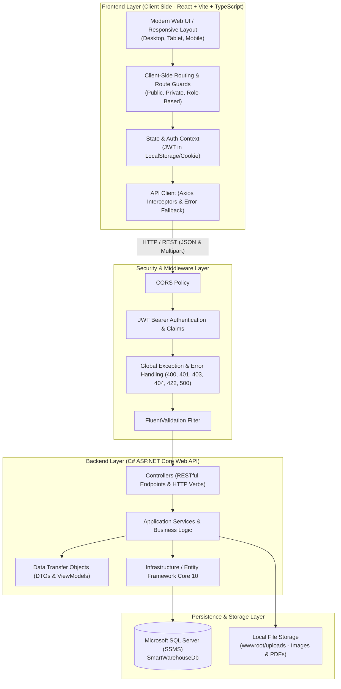
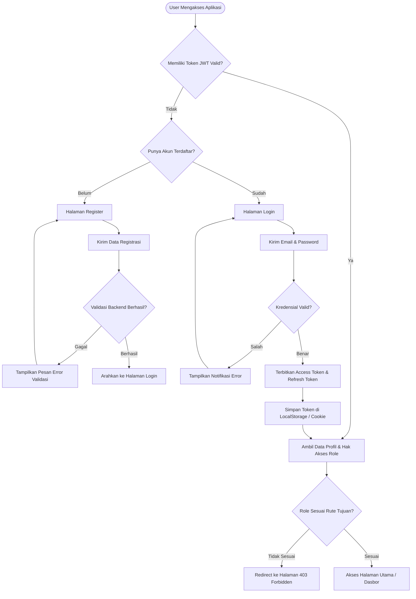
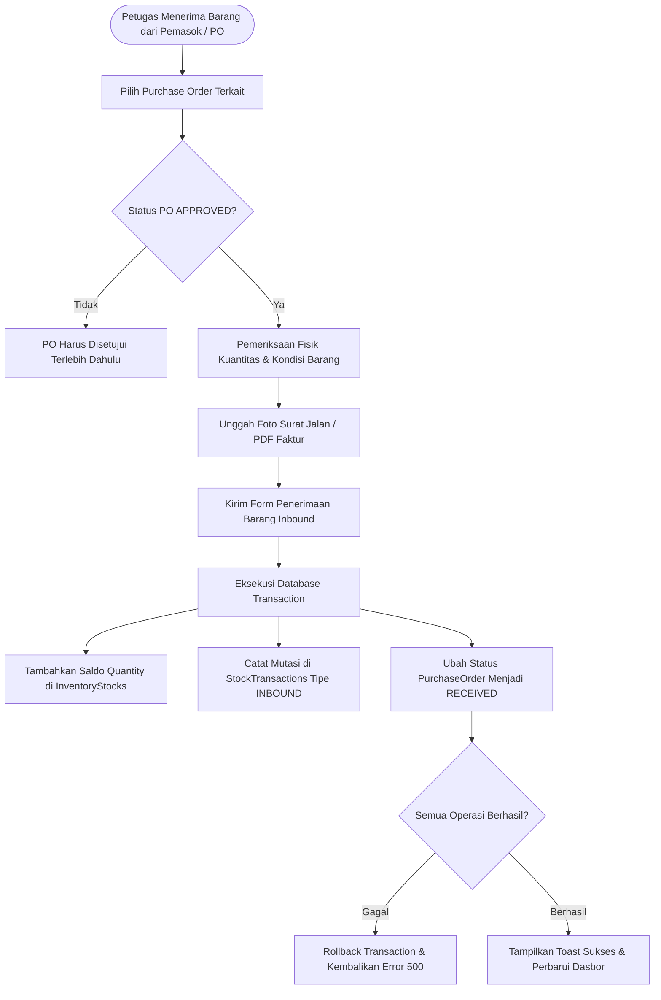
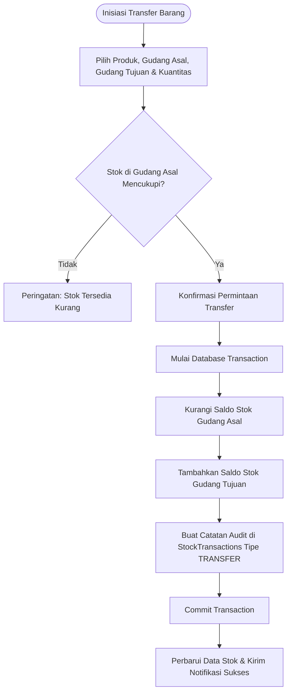
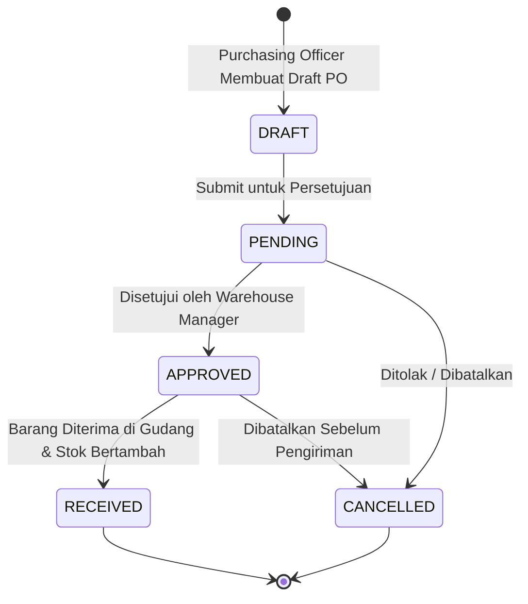
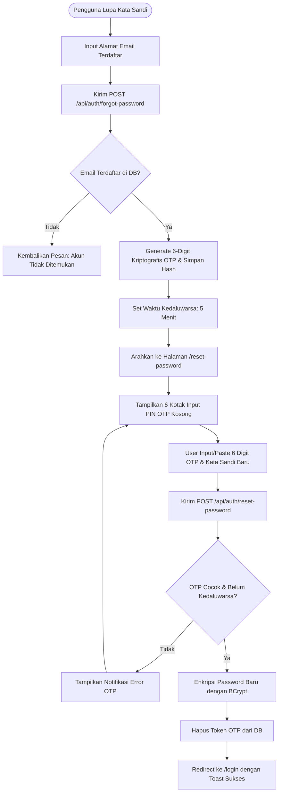

# ARCHITECTURE: System Architecture & Design Documentation

## 1. Gambaran Umum Arsitektur Sistem (High-Level Architecture)

**Smart Warehouse & Inventory Management System (SWIMS)** dibangun menggunakan arsitektur **Fullstack Monorepo**. Pemisahan antara sisi server (Backend API) dan sisi klien (Frontend SPA) dilakukan secara modular namun tetap berada dalam satu repositori kerja untuk mempermudah integrasi, deployment, dan pemeliharaan.



---

## 2. Struktur Direktori Monorepo

```
Smart Warehouse & Inventory Management System/
│
├── Docs/                              # Seluruh Berkas Dokumentasi Projekan S1
│   ├── API_SPECS.md                   # Spesifikasi REST API & Kontrak Data
│   ├── ARCHITECTURE.md                # Dokumentasi Arsitektur & Flowchart
│   ├── CONTEXT.md                     # Latar Belakang Bisnis & RBAC Matrix
│   ├── PLANNING.md                    # Roadmap & Manajemen Rencana Proyek
│   ├── PROGRESS.md                    # Lembar Pelacak Progres Interaktif
│   ├── SCHEMA.md                      # Kamus Data 3NF, ERD & Seed Data
│   └── KETENTUAN UMUM PEMBUATAN...pdf # Dokumen Acuan Persyaratan S1
│
├── backend/                           # Backend C# ASP.NET Core Web API
│   ├── SmartWarehouse.sln             # File Solusi .NET
│   └── SmartWarehouse.Api/
│       ├── Controllers/               # REST API Controllers
│       ├── Data/                      # DbContext, Migrations, Seeder, Scripts
│       │   ├── AppDbContext.cs
│       │   ├── DbSeeder.cs
│       │   └── Scripts/init_database.sql # Script SQL Mandiri untuk SSMS
│       ├── DTOs/                      # Request & Response Data Transfer Objects
│       ├── Middleware/                # Global Exception & Logging Middleware
│       ├── Models/Entities/           # Domain Entities (11 Tabel Relasional)
│       ├── Services/                  # Business Logic Services
│       ├── Validators/                # FluentValidation Rules
│       ├── wwwroot/uploads/           # Berkas Gambar & Dokumen PDF yang diunggah
│       ├── appsettings.json           # Konfigurasi Koneksi DB & JWT Key
│       └── Program.cs                 # Entry Point & Dependency Injection
│
├── frontend/                          # Frontend React + TypeScript + Vite
│   ├── public/                        # Static Assets & Icons
│   ├── src/
│   │   ├── assets/                    # Gambar & Style Tema
│   │   ├── components/                # Komponen Reusable (DataTable, Modal, Toast, Upload)
│   │   ├── context/                   # AuthContext & ThemeContext
│   │   ├── layouts/                   # MainLayout, AuthLayout, Sidebar, Navbar
│   │   ├── pages/                     # Halaman CRUD & View
│   │   │   ├── Auth/                  # Login, Register, Forgot/Reset Password
│   │   │   ├── Dashboard/             # Dashboard Real-time & Chart Analitik
│   │   │   ├── Products/              # List, Detail, Form Modal Produk
│   │   │   ├── Warehouses/            # List, Detail, Form Gudang
│   │   │   ├── Inventory/             # Monitoring Stok & Modal Mutasi/Transfer
│   │   │   ├── PurchaseOrders/        # List, Detail, Form PO Multi-item
│   │   │   ├── Suppliers/             # List & Modal Vendor Pemasok
│   │   │   ├── Categories/            # List & Modal Master Kategori
│   │   │   ├── Users/                 # Manajemen Pengguna & Profil
│   │   │   └── Errors/                # 401, 403, 404, 500 Error Pages
│   │   ├── routes/                    # AppRoutes, ProtectedRoute, RoleGuard
│   │   ├── services/                  # Axios API Client & Service Hooks
│   │   ├── types/                     # TypeScript Interface Definitions
│   │   ├── App.tsx                    # Root Component
│   │   └── main.tsx                   # Entry Point React
│   ├── package.json
│   ├── tsconfig.json
│   └── vite.config.ts
│
└── README.md                          # Panduan Menjalankan & Informasi Proyek
```

---

## 3. Diagram Alur Kerja Sistem (System Flowcharts)

### 3.1. Alur Autentikasi & Otorisasi Pengguna (Authentication & RBAC Flow)



### 3.2. Alur Penerimaan Barang Masuk (Inbound Receiving Flow)



### 3.3. Alur Mutasi / Transfer Antar Gudang (Warehouse Transfer Flow)



### 3.4. Siklus Hidup Dokumen Pengadaan (Purchase Order Lifecycle)



### 3.5. Alur Pemulihan Kata Sandi dengan 6-Digit OTP (OTP Password Reset Flow)



---

## 4. Arsitektur Keamanan (Security Architecture)

1. **Password Hashing**: Menggunakan algoritma **BCrypt** dengan *salt work factor* 11 untuk mengenkripsi seluruh kata sandi pengguna di database.
2. **JWT Authentication & Authorization**:
   - Token ditandatangani menggunakan algoritma `HMAC-SHA256` dengan kunci rahasia minimal 256-bit.
   - Mengandung *claims*: `userId`, `email`, `role`, `exp`, `nbf`.
   - Masa berlaku Access Token: 60 menit.
   - Refresh Token disimpan aman untuk pembaruan sesi otomatis tanpa login ulang.
3. **Pencegahan SQL Injection**: Seluruh interaksi basis data menggunakan ORM **Entity Framework Core** dengan parameterisasi query otomatis (`Parameterized Queries`). Tidak ada eksekusi *raw SQL string concatenation*.
4. **Proteksi XSS (Cross-Site Scripting)**:
   - Sanitasi input pada layer DTO dan validasi pola karakter.
   - React otomatis melakukan escaping terhadap data dinamis pada JSX template.
5. **CORS (Cross-Origin Resource Sharing)**: Konfigurasi kebijakan CORS yang ketat di ASP.NET Core (`WithOrigins`, `AllowAnyMethod`, `AllowAnyHeader`).
6. **Validasi Sisi Server**: Memanfaatkan **FluentValidation** untuk menguji aturan wajib, format email, batasan numerik, dan status enum sebelum request diteruskan ke service.
