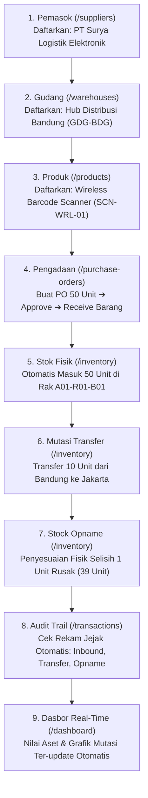

# 🎬 PANDUAN LENGKAP & NASKAH DEMO OPERASIONAL INVWARE
## Skenario Praktik Live: Dari Pendaftaran Pemasok & Gudang hingga Mutasi Stok Real-Time

> **Tujuan Dokumen**: Panduan langkah demi langkah dan naskah berbicara (*speaking script*) kata-per-kata yang dirancang khusus untuk rekaman layar (*screen recording*) lewat **Smartphone (HP)**, dengan laptop sebagai monitor naskah.
>
> **Metode Demonstrasi**: **Operasional Nyata (Live Data Input)**. Dosen akan melihat alur hidup sistem dari awal (pendaftaran supplier & gudang), pembuatan produk SKU, siklus PO pengadaan, penerimaan barang fisik ke rak, transfer antar fasilitas, stock opname, hingga tercermin otomatis pada grafik Dasbor Eksekutif.

---

## 📋 DAFTAR ISI
1. [Setup Perekaman Smartphone & Laptop](#1-setup-perekaman-smartphone--laptop)
2. [Peta Alur Kerja Operasional (The Golden Lifecycle Flow)](#2-peta-alur-kerja-operasional)
3. [Naskah Berbicara Kata-Per-Kata & Aksi Layar Smartphone](#3-naskah-berbicara-kata-per-kata--aksi-layar-smartphone)
   - [Langkah 0: Pembukaan & Konsep Mobile-First (00:00 - 00:50)](#langkah-0-pembukaan--konsep-mobile-first)
   - [Langkah 1: Pendaftaran Pemasok Baru / Supplier Setup (00:50 - 02:00)](#langkah-1-pendaftaran-pemasok-baru--supplier-setup)
   - [Langkah 2: Pendaftaran Fasilitas Gudang Baru / Warehouse Setup (02:00 - 03:10)](#langkah-2-pendaftaran-fasilitas-gudang-baru--warehouse-setup)
   - [Langkah 3: Pendaftaran Produk Baru & Master SKU (03:10 - 04:30)](#langkah-3-pendaftaran-produk-baru--master-sku)
   - [Langkah 4: Siklus Pengadaan (Purchase Order Lifecycle) (04:30 - 06:30)](#langkah-4-siklus-pengadaan-purchase-order-lifecycle)
   - [Langkah 5: Pengecekan Stok Fisik di Lokasi Rak / Bin Tracking (06:30 - 07:30)](#langkah-5-pengecekan-stok-fisik-di-lokasi-rak--bin-tracking)
   - [Langkah 6: Mutasi Transfer Antar Gudang & Pengeluaran Barang (07:30 - 08:45)](#langkah-6-mutasi-transfer-antar-gudang--pengeluaran-barang)
   - [Langkah 7: Audit Stock Opname & Penyesuaian Selisih (08:45 - 09:45)](#langkah-7-audit-stock-opname--penyesuaian-selisih)
   - [Langkah 8: Verifikasi Jejak Audit Mutasi (Transactions Audit Trail) (09:45 - 10:30)](#langkah-8-verifikasi-jejak-audit-mutasi)
   - [Langkah 9: Dampak Real-Time pada Dasbor Eksekutif & Analytics (10:30 - 11:30)](#langkah-9-dampak-real-time-pada-dasbor-eksekutif--analytics)
   - [Langkah 10: Keamanan RBAC, Arsitektur Cloud & Penutup (11:30 - 12:30)](#langkah-10-keamanan-rbac-arsitektur-cloud--penutup)
4. [Kunci Sukses & Contekan Jawaban Ujian (Q&A Defense)](#4-kunci-sukses--contekan-jawaban-ujian)

---

## 1. Setup Perekaman Smartphone & Laptop

### Di Smartphone (HP Anda):
1. Aktifkan mode **Jangan Ganggu (Do Not Disturb)** agar notifikasi chat/telepon tidak masuk.
2. Buka aplikasi browser (Chrome/Safari) ke alamat live: **`http://70.153.139.90`**.
3. Pastikan sudah berada di halaman login sebelum rekaman dimulai.
4. Aktifkan **Perekam Layar (Screen Recorder bawaan HP)** dengan opsi audio: **Mikrofon**.

### Di Layar Laptop Anda:
1. Buka dokumen ini [Docs/DEMO_PRESENTATION_SCRIPT.md](file:///d:/FAJAR%20SIDIK/Portofolio/Smart%20Warehouse%20&%20Inventory%20Management%20System/Docs/DEMO_PRESENTATION_SCRIPT.md) dalam ukuran layar penuh.
2. Gunakan laptop sebagai **teleprompter** agar Anda bisa membaca dengan tenang, tidak grogi, dan artikulasi suara jelas.

---

## 2. Peta Alur Kerja Operasional

Berikut adalah rantai siklus hidup barang yang akan Anda peragakan secara langsung di depan dosen:

---

## 3. Naskah Berbicara Kata-Per-Kata & Aksi Layar Smartphone

---

### LANGKAH 0: PEMBUKAAN & KONSEP MOBILE-FIRST
*(Estimasi Waktu: 00:00 - 00:50)*

**[AKSI DI HP]**:
- Tampilkan halaman login: `http://70.153.139.90/login`.
- Kursor/sentuhan jari berada di area tengah layar menyorot logo **InvWare**.

**[NASKAH SUARA]**:
> *"Selamat pagi / siang kepada Bapak / Ibu Dosen Pembimbing dan Penguji.*
> 
> *Perkenalkan, nama saya **Fajar Sidik**. Pada video ini, saya akan mendemonstrasikan secara langsung sistem tugas akhir / portofolio saya yang berjudul:*
> 
> ***InvWare — Smart Warehouse & Inventory Management System (SWIMS)***.
> 
> *Demonstrasi ini sengaja saya jalankan langsung dari **perangkat smartphone** yang terhubung secara live ke server cloud **Microsoft Azure** kami di alamat `http://70.153.139.90`.*
> 
> *Tujuannya adalah membuktikan kesiapan sistem secara **Mobile-First & Responsive**, mensimulasikan penggunaan nyata oleh staf di lantai gudang (*warehouse floor*) yang bergerak aktif tanpa membawa laptop.*
> 
> *Pada demo ini, saya tidak hanya akan memperlihatkan menu, melainkan **mempraktikkan alur operasional bisnis secara utuh dari nol**: mulai dari mendaftarkan pemasok, gudang baru, SKU produk, siklus Purchase Order, penerimaan barang ke rak, mutasi transfer, hingga audit stock opname."*

**[AKSI DI HP]**:
- Sentuh tombol demo **"Super Admin"** di kotak bawah.
- Form otomatis terisi `admin@smartwarehouse.com` dan `Password123!`.
- Tekan tombol **"Masuk Sekarang"**.
- Masuk ke halaman Dasbor (`/dashboard`).

---

### LANGKAH 1: PENDAFTARAN PEMASOK BARU (SUPPLIER SETUP)
*(Estimasi Waktu: 00:50 - 02:00)*

**[AKSI DI HP]**:
- Sentuh ikon garis tiga (**Hamburger Menu**) di pojok kiri atas untuk membuka Sidebar Drawer.
- Pilih menu **"Pemasok"** (`/suppliers`).
- Layar menampilkan daftar supplier yang sudah ada.
- Tekan tombol **"+ Tambah Pemasok"**.

**[NASKAH SUARA]**:
> *"Langkah pertama dalam rantai pasok adalah mendaftarkan mitra vendor atau pemasok barang.*
> 
> *Kita buka menu **Pemasok**, lalu tekan tombol **Tambah Pemasok**. Mari kita daftarkan salah satu vendor distributor resmi elektronik."*

**[AKSI DI HP]**:
- Masukkan data pada formulir:
  - **Kode Pemasok**: `SUP-SLE-01`
  - **Nama Perusahaan**: `PT Surya Logistik Elektronik`
  - **Nama Kontak**: `Bapak Hendra Gunawan`
  - **Alamat Email**: `hendra@suryalogistik.co.id`
  - **Nomor Telepon**: `081122334455`
  - **Alamat**: `Kawasan Industri Pulogadung Blok B No. 12, Jakarta Timur`
- Tekan tombol **"Simpan Pemasok"**.
- Notifikasi toast hijau muncul: *"Pemasok berhasil ditambahkan"*.
- Tunjukkan bahwa `PT Surya Logistik Elektronik` sudah langsung masuk di baris teratas tabel.

**[NASKAH SUARA]**:
> *"Bisa kita lihat, pemasok **PT Surya Logistik Elektronik** telah sukses terdaftar di basis data SQL Server dengan status Aktif. Vendor ini yang nantinya akan menjadi pemasok resmi untuk pengadaan barang kita."*

---

### LANGKAH 2: PENDAFTARAN FASILITAS GUDANG BARU (WAREHOUSE SETUP)
*(Estimasi Waktu: 02:00 - 03:10)*

**[AKSI DI HP]**:
- Buka Hamburger Menu, pilih menu **"Gudang"** (`/warehouses`).
- Layar menampilkan daftar fasilitas gudang (Jakarta, Surabaya, Cikarang).
- Tekan tombol **"+ Tambah Gudang"**.

**[NASKAH SUARA]**:
> *"Langkah kedua, perusahaan membutuhkan fasilitas penyimpanan fisik.*
> 
> *InvWare mendukung arsitektur multi-gudang (*Multi-Facility Network*). Sekarang kita buka menu **Gudang**, lalu tekan **Tambah Gudang** untuk memperluas jaringan distribusi kita ke kota Bandung."*

**[AKSI DI HP]**:
- Masukkan data pada formulir modal:
  - **Kode Gudang**: `GDG-BDG`
  - **Nama Gudang**: `Hub Distribusi Bandung Timur`
  - **Kota**: `Bandung`
  - **Kapasitas (m²)**: `3500`
  - **Alamat**: `Jl. Soekarno Hatta No. 789, Gedebage, Bandung`
- Tekan tombol **"Simpan Gudang"**.
- Toast hijau muncul: *"Gudang berhasil ditambahkan"*.
- Geser tabel ke samping (horizontal touch scroll) untuk memperlihatkan kapasitas 3.500 m² dan status aktif.

**[NASKAH SUARA]**:
> *"Fasilitas **Hub Distribusi Bandung Timur** dengan kode `GDG-BDG` kini telah aktif terdaftar dalam sistem. Gudang ini yang akan menjadi tujuan penerimaan barang pengadaan kita."*

---

### LANGKAH 3: PENDAFTARAN PRODUK BARU & MASTER SKU
*(Estimasi Waktu: 03:10 - 04:30)*

**[AKSI DI HP]**:
- Buka Hamburger Menu, pilih menu **"Produk"** (`/products`).
- Tekan tombol **"+ Tambah Produk"**.

**[NASKAH SUARA]**:
> *"Langkah ketiga adalah membuat master data produk atau SKU barang yang akan diperjualbelikan atau disimpan.*
> 
> *Kita masuk ke menu **Produk** lalu tekan **Tambah Produk**. Kita akan daftarkan satu unit perangkat keras pergudangan baru."*

**[AKSI DI HP]**:
- Masukkan data pada formulir modal:
  - **Kode SKU**: `SCN-WRL-01`
  - **Nama Produk**: `Wireless Industrial Barcode Scanner`
  - **Barcode**: `8991234567890`
  - **Kategori**: Pilih `Elektronik`
  - **Satuan (Unit)**: `Unit`
  - **Harga Modal (Beli)**: `450000`
  - **Harga Jual**: `750000`
  - **Min. Stok (Safety Stock)**: `10`
  - **Max. Stok**: `200`
  - **Deskripsi**: `Pemindai barcode nirkabel tahan benturan IP65 untuk operasional picking gudang.`
- Tekan tombol **"Simpan Produk"**.
- Toast hijau muncul: *"Produk berhasil ditambahkan"*.
- Ketik `"Barcode Scanner"` pada kotak pencarian di tabel. Produk langsung terfilter.

**[NASKAH SUARA]**:
> *"Produk **Wireless Industrial Barcode Scanner** dengan SKU `SCN-WRL-01` telah berhasil kita buat.*
> 
> *Perhatikan bahwa saat ini, saldo fisik produk ini di gudang masih **0 unit**, karena kita belum melakukan pengadaan fisik barang. Sekarang mari kita lakukan transaksi pengadaan resmi melalui Purchase Order."*

---

### LANGKAH 4: SIKLUS PENGADAAN (PURCHASE ORDER LIFECYCLE)
*(Estimasi Waktu: 04:30 - 06:30 — **BAGIAN PALING KRUSIAL**)*

**[AKSI DI HP]**:
- Buka Hamburger Menu, pilih menu **"Purchase Orders"** (`/purchase-orders`).
- Tekan tombol **"+ Buat PO Baru"**.

**[NASKAH SUARA]**:
> *"Sekarang kita masuk ke alur inti pengadaan barang. Sistem InvWare mengontrol alur pengadaan dengan siklus hidup dokumen berjenjang:*
> *Dari status **DRAFT** ➔ diajukan **PENDING** ➔ disetujui **APPROVED** ➔ hingga barang tiba dan berstatus **RECEIVED**.*
> 
> *Mari kita buat Purchase Order baru untuk produk scanner tadi kepada vendor yang baru kita daftarkan."*

**[AKSI DI HP]**:
- Pada modal Buat PO:
  - **Pilih Pemasok**: Pilih `PT Surya Logistik Elektronik`.
  - **Tanggal Perkiraan Tiba**: Pilih tanggal beberapa hari ke depan (misal: akhir bulan).
  - **Catatan**: `Pengadaan batch pertama untuk fasilitas Bandung`.
  - Pada bagian Item PO, tekan tombol **"+ Tambah Item"**:
    - **Pilih Produk**: Pilih `Wireless Industrial Barcode Scanner (SCN-WRL-01)`.
    - **Kuantitas**: Isi `50`.
    - **Harga Satuan**: Terisi otomatis `450000` (Total kalkulasi otomatis: Rp 22.500.000).
- Tekan tombol **"Buat Purchase Order"**.
- Toast hijau muncul: *"Purchase Order berhasil dibuat!"*.
- Tunjukkan PO baru muncul di tabel dengan status **`PENDING`** atau **`DRAFT`**.

**[NASKAH SUARA]**:
> *"Dokumen PO telah diterbitkan dengan nomor referensi unik sistem. Total nilai pengadaan adalah Rp 22.500.000.*
> 
> *Sebagai manajer, kita akan menyetujui dokumen ini dengan menekan tombol aksi **Setujui (Approve)**."*

**[AKSI DI HP]**:
- Sentuh baris PO tersebut atau tekan tombol ikon centang/status untuk mengubah statusnya menjadi **APPROVED**.
- Status PO berubah menjadi badge biru: **`APPROVED`**.

**[NASKAH SUARA]**:
> *"Status dokumen kini telah menjadi **APPROVED**. Sekarang, kita simulasikan saat truk pengiriman tiba di fasilitas gudang dan staf gudang memeriksa fisik barang.*
> 
> *Kita tekan tombol **Terima Barang (Receive)**. Di sinilah letak keunggulan otomatisasi sistem InvWare."*

**[AKSI DI HP]**:
- Tekan tombol aksi **"Terima Barang (Receive)"** pada PO tersebut.
- Modal konfirmasi penerimaan muncul:
  - **Gudang Tujuan**: Pilih `Hub Distribusi Bandung Timur` (gudang yang kita buat tadi).
  - **Lokasi Rak (Bin Location)**: Ketik `A01-R01-B01`.
  - **Catatan Penerimaan**: `Barang 50 unit diterima lengkap dalam kondisi prima`.
- Tekan tombol **"Konfirmasi Penerimaan Barang"**.
- Status PO berubah menjadi badge hijau: **`RECEIVED`**.

**[NASKAH SUARA]**:
> *"Perhatikan Bapak/Ibu Dosen, saat tombol konfirmasi penerimaan ditekan:*
> *Backend ASP.NET Core mengeksekusi transaksi database secara atomik:*
> 1. *Pertama, status PO ditutup menjadi **RECEIVED**.*
> 2. *Kedua, kuantitas 50 unit secara otomatis masuk dan menambah saldo stok fisik di **Hub Distribusi Bandung Timur** pada koordinat rak **A01-R01-B01**.*
> 3. *Ketiga, sistem secara otomatis menerbitkan dokumen transaksi **INBOUND** lengkap dengan nomor referensi PO.*
> 
> *Mari kita buktikan secara langsung di modul Inventaris!"*

---

### LANGKAH 5: PENGECEKAN STOK FISIK DI LOKASI RAK (BIN TRACKING)
*(Estimasi Waktu: 06:30 - 07:30)*

**[AKSI DI HP]**:
- Buka Hamburger Menu, pilih menu **"Inventaris & Stok"** (`/inventory`).
- Pada filter gudang di bagian atas, pilih: **`Hub Distribusi Bandung Timur`**.
- Geser layar ke baris produk **`Wireless Industrial Barcode Scanner`**.

**[NASKAH SUARA]**:
> *"Kita buka modul **Inventaris & Pelacakan Rak Fisik**, lalu filter fasilitas ke **Hub Distribusi Bandung Timur**.*
> 
> *Bisa kita lihat bersama di layar:*
> - *Produk scanner kita sekarang tercatat memiliki kuantitas **On Hand: 50 unit**.*
> - *Status ketersediaan **Available: 50 unit**.*
> - *Dan posisi barang terpetakan secara presisi pada kode rak **A01-R01-B01**.*
> 
> *Status badge stok berwarna hijau menandakan persediaan aman di atas ambang batas minimum. Staf picker di gudang dapat langsung menemukan posisi fisik barang ini dengan akurat."*

---

### LANGKAH 6: MUTASI TRANSFER ANTAR GUDANG & PENGELUARAN BARANG
*(Estimasi Waktu: 07:30 - 08:45)*

**[AKSI DI HP]**:
- Pada baris produk scanner tersebut, tekan tombol aksi **"Transfer Gudang"** (ikon panah bolak-balik).
- Modal Transfer Antar Fasilitas muncul:
  - **Gudang Asal**: Terkunci `Hub Distribusi Bandung Timur`.
  - **Gudang Tujuan**: Pilih `Jakarta Main Distribution Hub`.
  - **Kuantitas Ditransfer**: Isi `10`.
  - **Lokasi Rak Tujuan**: Isi `B02-R01-B01`.
  - **Alasan**: `Pemenuhan pesanan cabang Jakarta`.
- Tekan tombol **"Kirim Transfer Stok"**.
- Toast hijau muncul: *"Transfer stok berhasil diproses"*.

**[NASKAH SUARA]**:
> *"Sekarang kita uji fitur logistik mutasi: **Inter-Warehouse Transfer**.*
> 
> *Kita transfer sebanyak **10 unit** dari gudang Bandung ke gudang utama Jakarta.*
> 
> *Perhatikan: stok di Bandung sekarang otomatis berkurang dari 50 menjadi **40 unit**.*
> 
> *Dan jika kita ubah filter gudang ke **Jakarta Main Distribution Hub**, produk scanner tersebut sudah bertambah sebanyak **10 unit** pada koordinat rak B02-R01-B01 secara instan tanpa ada selisih kuantitas."*

---

### LANGKAH 7: AUDIT STOCK OPNAME & PENYESUAIAN SELISIH
*(Estimasi Waktu: 08:45 - 09:45)*

**[AKSI DI HP]**:
- Kembalikan filter gudang ke **Hub Distribusi Bandung Timur** (stok saat ini: 40 unit).
- Tekan tombol aksi **"Penyesuaian (Adjustment)"** (ikon slider) pada produk scanner.
- Modal Stock Opname muncul:
  - **Kuantitas Fisik Riil Terhitung**: Ubah angka dari 40 menjadi `39`.
  - **Alasan Penyesuaian**: `Selisih opname fisik: 1 unit cacat kemasan saat handling`.
- Tekan tombol **"Simpan Penyesuaian"**.
- Toast hijau muncul: *"Penyesuaian stok berhasil disimpan"*.
- Angka On Hand di tabel berubah menjadi **39 unit**.

**[NASKAH SUARA]**:
> *"Dalam operasional nyata pergudangan, selalu ada kemungkinan terjadi selisih fisik saat stock opname berkala (misal barang rusak saat handling forklift).*
> 
> *InvWare menyediakan modul **Stock Opname Adjustment** yang akuntabel. Kita sesuaikan kuantitas riil menjadi **39 unit** dengan menyertakan alasan resmi.*
> 
> *Saldo langsung ter-update menjadi 39 unit, dan sistem secara otomatis mencatat selisih -1 unit ini ke dalam audit trail."*

---

### LANGKAH 8: VERIFIKASI JEJAK AUDIT MUTASI (TRANSACTIONS AUDIT TRAIL)
*(Estimasi Waktu: 09:45 - 10:30)*

**[AKSI DI HP]**:
- Buka Hamburger Menu, pilih menu **"Riwayat Transaksi"** (`/transactions`).
- Layar menampilkan tabel audit log transaksi logistik.

**[NASKAH SUARA]**:
> *"Seluruh rangkaian tindakan fisik yang baru saja kita lakukan tercatat secara permanen tanpa celah manipulasi di menu **Riwayat Transaksi** ini.*
> 
> *Bisa kita lihat urutan jejak auditnya:*
> 1. *Transaksi **INBOUND**: +50 unit dari penerimaan PO.*
> 2. *Transaksi **TRANSFER**: -10 unit pengiriman dari Bandung ke Jakarta.*
> 3. *Transaksi **ADJUSTMENT**: -1 unit hasil audit stock opname dengan catatan alasan resmi.*
> 
> *Setiap transaksi dilengkapi stempel waktu (*timestamp*), referensi dokumen, dan identitas staf pelaksana. Data ini bersifat *immutable* untuk memenuhi standar audit ISO dan kepatuhan pergudangan."*

---

### LANGKAH 9: DAMPAK REAL-TIME PADA DASBOR EKSEKUTIF & ANALYTICS
*(Estimasi Waktu: 10:30 - 11:30)*

**[AKSI DI HP]**:
- Buka Hamburger Menu, kembali ke menu **"Dasbor"** (`/dashboard`).
- Sorot 4 kartu KPI di bagian atas.
- Tekan tombol **Multi-Currency Switcher (USD / IDR)** di pojok kanan atas.
- Gulir ke bawah melihat grafik tren mutasi dan feed aktivitas terkini.

**[NASKAH SUARA]**:
> *"Sekarang mari kita kembali ke Dasbor Eksekutif.*
> 
> *Perhatikan bagaimana seluruh transaksi nyata yang kita lakukan barusan langsung berdampak secara real-time pada metrik eksekutif:*
> 1. *Kartu **Total Nilai Aset Inventaris** langsung bertambah merefleksikan nilai aset 39 unit scanner baru ditambah barang lainnya.*
> 2. *Kita coba tombol **Currency Switcher**: nilai aset puluhan juta ini dapat langsung dikonversi secara presisi ke dalam mata uang US Dollar ($).*
> 3. *Grafik **Tren Mutasi** otomatis memperbarui bar Inbound dan Outbound pada periode berjalan.*
> 4. *Dan pada daftar **Aktivitas Terkini**, seluruh aksi kita (PO received, transfer, dan opname) telah terpampang jelas."*

---

### LANGKAH 10: KEAMANAN RBAC, ARSITEKTUR CLOUD & PENUTUP
*(Estimasi Waktu: 11:30 - 12:30)*

**[AKSI DI HP]**:
- Buka Hamburger Menu, sentuh menu **"Pengguna"** (`/users`). Tunjukkan daftar 20 staf.
- Buka menu **Profil** (`/profile`) atau kembali ke Dasbor.

**[NASKAH SUARA]**:
> *"Sebagai penutup, sistem InvWare diproteksi dengan arsitektur rekayasa perangkat lunak enterprise:*
> - *Keamanan **Role-Based Access Control (RBAC)** membatasi akses sensitif seperti menu Pengguna ini hanya untuk Super Admin.*
> - *Backend dibangun dengan **C# ASP.NET Core 10 Web API** berprinsip **Clean Architecture**, database relasional **Microsoft SQL Server 2022** dalam normalisasi **3NF**, serta frontend **React 19 Vite**.*
> - *Dan yang paling membanggakan, seluruh sistem ini telah aktif berjalan secara kontainerisasi menggunakan **Docker Compose** di **Microsoft Azure Virtual Machine (Ubuntu 24.04 LTS)** pada IP publik `http://70.153.139.90` yang kita akses secara mulus di smartphone ini.*
> 
> *Demikian pembuktian alur operasional InvWare dari hulu ke hilir. Terima kasih banyak atas perhatian Bapak / Ibu Dosen Pembimbing dan Penguji. Saya siap untuk sesi diskusi dan tanya jawab. Terima kasih."*

---

## 4. Kunci Sukses & Contekan Jawaban Ujian (Q&A Defense)

Dosen penguji biasanya akan menguji pemahaman Anda setelah melihat demo operasional ini. Berikut adalah contekan jawaban cerdas:

### Pertanyaan 1: *"Bagaimana sistem menjamin stok tidak menjadi minus saat ada transfer atau pengeluaran barang?"*
> **Jawaban Anda**:
> *"Di backend ASP.NET Core, kami menerapkan validasi bertingkat:*
> *Sebelum kuantitas dikurangi, sistem mengecek saldo `Available Quantity = QuantityOnHand - AllocatedQuantity`. Jika kuantitas transfer melebihi stok yang tersedia, sistem secara tegas melempar HTTP 400 Bad Request dengan pesan error valid, dan seluruh proses dibungkus dalam **Database Transaction (ACID)** sehingga tidak akan pernah terjadi kondisi stok negatif ataupun data menggantung."*

### Pertanyaan 2: *"Mengapa saat PO di-Receive, stok langsung bertambah tanpa perlu input manual lagi di modul inventaris?"*
> **Jawaban Anda**:
> *"Ini adalah inti dari **Enterprise Resource Planning (ERP Integration)** yang kami terapkan. Di dunia logistik nyata, menginput ulang barang yang sudah ada di dokumen PO sangat rawan *human error* dan *fraud* (manipulasi data).*
> *Oleh karena itu, saat staf menekan 'Receive', backend membaca relasi `PurchaseOrderItems`, lalu secara otomatis meng-query atau membuat record di tabel `InventoryStocks` dan menerbitkan `StockTransaction` bertipe `INBOUND` dalam satu kali eksekusi atomic transaction."*

### Pertanyaan 3: *"Mengapa memilih SQL Server 2022 dibanding database NoSQL seperti MongoDB?"*
> **Jawaban Anda**:
> *"Karena sistem manajemen inventaris dan pergudangan membutuhkan konsistensi data yang mutlak (**Strong Consistency & ACID Guarantees**).*
> *Relasi antara User, PO, Supplier, Lokasi Rak, dan Mutasi Transaksi memiliki dependensi relasional yang ketat dengan integritas referensial (Foreign Keys). SQL Server menjamin tidak ada data yatim (orphaned records) dan sangat optimal untuk agregasi laporan keuangan nilai aset."*

### Pertanyaan 4: *"Bagaimana aplikasi di HP bisa begitu cepat mengakses server di Azure tanpa ada masalah CORS?"*
> **Jawaban Anda**:
> *"Kami menggunakan **Nginx Reverse Proxy** di port 80 pada Azure VM. Nginx melayani berkas statis React di root, dan setiap request `/api/` diteruskan secara internal ke container backend Kestrel di port 5000 melalui Docker bridge network.*
> *Karena browser HP berkomunikasi ke satu origin yang sama (same-origin policy), maka tidak ada hambatan CORS sama sekali dan latency transmisi data menjadi sangat rendah."*
