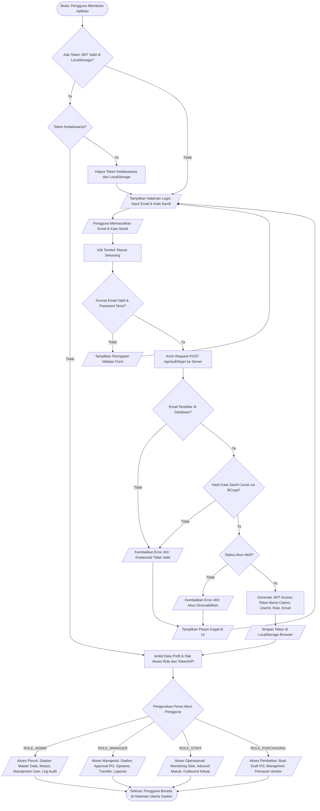
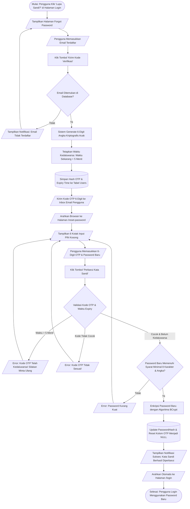
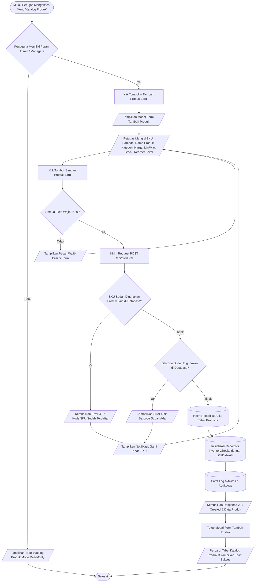
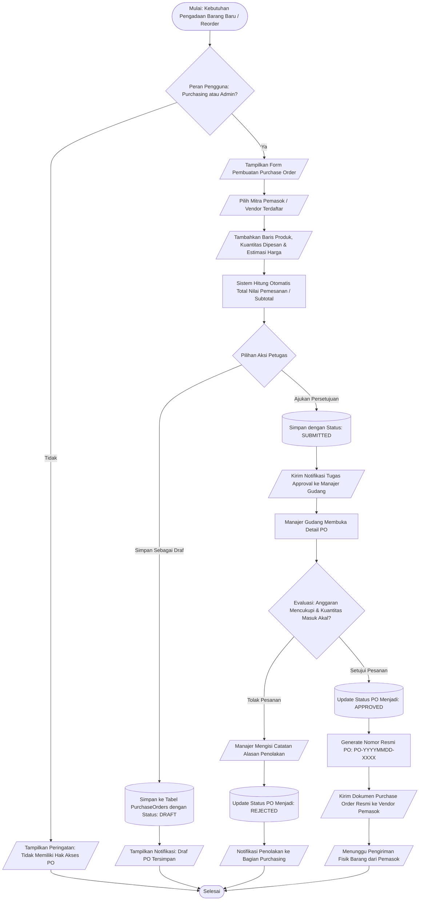
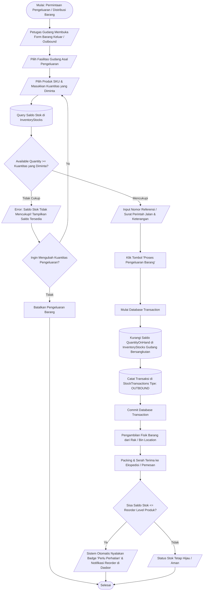

# DOKUMENTASI FLOWCHART SISTEM (INVWARE)
## Standar Flowchart Sistem (Start > Process > Decision > End) Menggunakan Mermaid.js

Dokumen ini berisi kumpulan **Flowchart Standar Sistem (Standard System Flowcharts)** untuk seluruh alur kerja operasional **InvWare (Smart Warehouse & Inventory Management System)**.

Semua diagram dibuat menggunakan sintaks resmi **Mermaid.js** (`flowchart TD`) dengan kaidah simbol standar flowchart (ISO/draw.io):
- **Terminal `([Mulai / Selesai])`**: Titik awal dan akhir alur proses.
- **Proses `[Aksi / Langkah Kerja]`**: Aktivitas pemrosesan data atau eksekusi sistem.
- **Keputusan `{Kondisi / Validasi?}`**: Percabangan logika keputusan (*Ya* / *Tidak*).
- **Input/Output `[/Input Pengguna / Output Tampilan/]`**: Masukan data pengguna atau antarmuka.
- **Database `[(Basis Data / Tabel)]`**: Penyimpanan dan pembacaan data persisten.

> **Cara Menggunakan di draw.io**:
> 1. Buka [app.diagrams.net](https://app.diagrams.net/) (draw.io).
> 2. Klik menu **Arrange** > **Insert** > **Advanced** > **Mermaid**.
> 3. Salin (*copy*) kode diagram di bawah ini lalu tempel (*paste*) ke kotak dialog draw.io.
> 4. Klik tombol **Insert**, flowchart akan otomatis ter-generate rapi dan siap diedit/diubah warna.
> 
> **Cara Menggunakan di mermaid.live**:
> Buka [mermaid.live](https://mermaid.live/) lalu tempel kode diagram ke panel editor kiri.

---

## DAFTAR ISI FLOWCHART
0. [FLOWCHART MASTER SISTEM TERINTEGRASI (UNIFIED END-TO-END)](#0-flowchart-master-sistem-terintegrasi-unified-end-to-end) ⭐ **(Satu Kesatuan Utuh)**
1. [Flowchart 1: Alur Autentikasi Pengguna & Hak Akses (Login & RBAC)](#1-alur-autentikasi-pengguna--hak-akses-login--rbac)
2. [Flowchart 2: Alur Pemulihan Kata Sandi dengan 6-Digit OTP](#2-alur-pemulihan-kata-sandi-dengan-6-digit-otp)
3. [Flowchart 3: Alur Manajemen Master Produk & Validasi Kode SKU](#3-alur-manajemen-master-produk--validasi-kode-sku)
4. [Flowchart 4: Alur Pengadaan Barang / Purchase Order (PO Lifecycle)](#4-alur-pengadaan-barang--purchase-order-po-lifecycle)
5. [Flowchart 5: Alur Penerimaan Barang Masuk (Inbound Receiving & Update Stok)](#5-alur-penerimaan-barang-masuk-inbound-receiving--update-stok)
6. [Flowchart 6: Alur Pengeluaran Barang (Outbound Dispatch & Cek Stok Minimum)](#6-alur-pengeluaran-barang-outbound-dispatch--cek-stok-minimum)
7. [Flowchart 7: Alur Transfer Stok Antar Fasilitas Gudang (Inter-Warehouse Transfer)](#7-alur-transfer-stok-antar-fasilitas-gudang-inter-warehouse-transfer)
8. [Flowchart 8: Alur Stock Opname & Penyesuaian Selisih Inventaris (Stock Adjustment)](#8-alur-stock-opname--penyesuaian-selisih-inventaris-stock-adjustment)
9. [Flowchart 9: Alur Arsitektur End-to-End Request/Response Sistem](#9-alur-arsitektur-end-to-end-requestresponse-sistem)

---

## 0. FLOWCHART MASTER SISTEM TERINTEGRASI (UNIFIED END-TO-END)
> **Satu Kesatuan Utuh**: Diagram ini merangkum seluruh operasional sistem dari `Start ([Mulai])` login & autentikasi, pemilihan menu operasional, siklus PO, barang masuk (Inbound), barang keluar (Outbound), transfer antar fasilitas, stock opname, hingga `End ([Selesai])` penutupan sesi. Berkas visual Draw.io yang siap diedit dapat diakses di: [`Docs/flowcharts/Flowcharts.drawio`](file:///d:/FAJAR%20SIDIK/Portofolio/Smart%20Warehouse%20&%20Inventory%20Management%20System/Docs/flowcharts/Flowcharts.drawio).

```mermaid
flowchart TD
    Start([Mulai: Pengguna Membuka Sistem InvWare]) --> CheckToken{Memiliki Token JWT Valid?}

    %% 1. AUTENTIKASI
    subgraph SUB_AUTH ["1. Alur Autentikasi & Pemulihan Akun"]
        CheckToken -- Tidak / Kadaluwarsa --> ViewLogin[/Tampilkan Halaman Login/]
        ViewLogin --> ActionAuthChoice{Pilihan Tindakan Pengguna}
        
        %% Lupa Sandi
        ActionAuthChoice -- Lupa Kata Sandi --> InputForgotEmail[/Input Alamat Email Terdaftar/]
        InputForgotEmail --> CheckEmailDB{Email Terdaftar di DB?}
        CheckEmailDB -- Tidak --> ShowEmailErr[/Peringatan: Email Tidak Ditemukan/] --> InputForgotEmail
        CheckEmailDB -- Ya --> GenOTP[Sistem Generate 6-Digit Kriptografis OTP & Masa Berlaku 5 Menit]
        GenOTP --> SendEmailOTP[/Kirim Kode OTP ke Email Pengguna/]
        SendEmailOTP --> ViewOTPPage[/Tampilkan 6 Kotak Input PIN OTP/]
        ViewOTPPage --> InputOTPAndNewPass[/Input 6 Digit OTP & Kata Sandi Baru/]
        InputOTPAndNewPass --> VerifyOTP{OTP Cocok & Belum Expired?}
        VerifyOTP -- Tidak --> ShowOTPErr[/Error: Kode OTP Salah / Kedaluwarsa/] --> ViewOTPPage
        VerifyOTP -- Ya --> HashNewPassword[Enkripsi Password Baru dengan BCrypt]
        HashNewPassword --> UpdatePassDB[(Update PasswordHash di Database Users)]
        UpdatePassDB --> ShowPassSuccess[/Notifikasi: Sandi Berhasil Diperbarui/] --> ViewLogin

        %% Login
        ActionAuthChoice -- Masuk Akun --> InputCreds[/Masukkan Email & Kata Sandi/]
        InputCreds --> SubmitLogin[Klik Tombol 'Masuk Sekarang']
        SubmitLogin --> CheckCreds{Kredensial & Status Akun Aktif?}
        CheckCreds -- Tidak Valid --> ShowLoginErr[/Error: Email atau Kata Sandi Salah/] --> ViewLogin
        CheckCreds -- Valid --> IssueJWT[Terbitkan JWT Token Berisi Claims Role Pengguna]
        IssueJWT --> SaveSession[/Simpan JWT Token di LocalStorage Browser/]
    end

    CheckToken -- Ya Valid --> LoadProfile[Ambil Data Profil & Hak Akses Peran]
    SaveSession --> LoadProfile

    %% 2. DASBOR & MENU
    subgraph SUB_DASHBOARD ["2. Dasbor Utama & Navigasi Operasional"]
        LoadProfile --> RenderDashboard[/Tampilkan Dasbor: KPI Aset Stok, Peringatan Level Reorder, & Grafik Mutasi/]
        RenderDashboard --> ChooseMenu{Pilih Menu Operasional}
    end

    %% 3. MASTER PRODUK
    subgraph SUB_PRODUCT ["3. Manajemen Master Produk"]
        ChooseMenu -- Katalog Produk --> ViewProductList[/Tampilkan Tabel Katalog Produk/]
        ViewProductList --> ProductActionChoice{Aksi Produk}
        ProductActionChoice -- Tambah Produk Baru --> OpenProductModal[/Tampilkan Form Tambah Produk/]
        OpenProductModal --> FillProductData[/Isi SKU, Barcode, Nama, Kategori, Harga & Min-Max Stock/]
        FillProductData --> CheckSKUUniq{SKU & Barcode Belum Pernah Ada di DB?}
        CheckSKUUniq -- Duplikat --> ShowSKUErr[/Error: SKU atau Barcode Sudah Digunakan!/] --> FillProductData
        CheckSKUUniq -- Unik --> SaveProductDB[(Simpan Produk Baru ke Tabel Products)]
        SaveProductDB --> InitStockZero[(Inisialisasi Record InventoryStocks dengan Saldo Awal 0)]
        InitStockZero --> ProductDone[Tutup Modal & Refresh Tabel Produk]
        ProductActionChoice -- Lihat / Cari / Export Excel --> ExportOrSearch[Pencarian SKU / Ekspor Berkas .xlsx] --> ProductDone
    end

    %% 4. PURCHASE ORDER
    subgraph SUB_PO ["4. Pengadaan Barang / Purchase Order (PO)"]
        ChooseMenu -- Pesanan Pembelian --> ViewPOList[/Tampilkan Daftar Purchase Order/]
        ViewPOList --> POActionChoice{Aksi Pengadaan PO}
        POActionChoice -- Buat PO Baru --> OpenPOForm[/Form PO: Pilih Vendor Pemasok & Daftar Barang Dipesan/]
        OpenPOForm --> SavePOChoice{Simpan Sebagai?}
        SavePOChoice -- Simpan Draf --> SaveDraftDB[(Simpan ke PurchaseOrders Status: DRAFT)] --> PODone[Selesai Pembuatan PO]
        SavePOChoice -- Ajukan Persetujuan --> SubmitPODB[(Simpan ke PurchaseOrders Status: SUBMITTED)]
        SubmitPODB --> ManagerReviewPO[Manajer Gudang Meninjau Dokumen PO]
        ManagerReviewPO --> ManagerPOCheck{Evaluasi Manajer Gudang}
        ManagerPOCheck -- Tolak Pesanan --> RejectPODB[(Ubah Status PO Menjadi: REJECTED)] --> PODone
        ManagerPOCheck -- Setujui Pesanan --> ApprovePODB[(Ubah Status PO Menjadi: APPROVED)]
        ApprovePODB --> SendPOToSupplier[/Kirim Dokumen PO Resmi ke Mitra Pemasok/] --> AwaitDelivery[Menunggu Pengiriman Fisik dari Vendor] --> PODone
    end

    %% 5. INBOUND
    subgraph SUB_INBOUND ["5. Penerimaan Barang Masuk (Inbound Receiving)"]
        ChooseMenu -- Penerimaan Inbound --> OpenInboundList[/Buka Daftar PO Siap Diterima/]
        OpenInboundList --> SelectApprovedPO[/Pilih PO dengan Status APPROVED/]
        SelectApprovedPO --> InspectPhysical[Pemeriksaan Fisik Kuantitas & Kondisi Barang di Loading Dock]
        InspectPhysical --> UploadSuratJalan[/Unggah Foto Bukti Surat Jalan / Faktur/]
        UploadSuratJalan --> SelectTargetRack[/Tentukan Gudang & Lokasi Rak/Bin Penyimpanan/]
        SelectTargetRack --> ConfirmInboundSubmit[Klik Konfirmasi Penerimaan Barang Masuk]
        ConfirmInboundSubmit --> InboundDBTrx[Mulai Database Transaction ACID]
        InboundDBTrx --> AddStockOnHand[(Tambahkan Nilai QuantityOnHand di InventoryStocks)]
        AddStockOnHand --> LogInboundTrx[(Insert Record Baru di StockTransactions: Tipe INBOUND)]
        LogInboundTrx --> ClosePOStatus[(Ubah Status PurchaseOrders Menjadi: RECEIVED)]
        ClosePOStatus --> CommitInbound[Commit Transaksi Inbound ke Database]
    end

    %% 6. OUTBOUND
    subgraph SUB_OUTBOUND ["6. Pengeluaran Barang (Outbound Fulfillment)"]
        ChooseMenu -- Pengeluaran Outbound --> OpenOutboundForm[/Form Outbound: Pilih Gudang, Produk & Kuantitas/]
        OpenOutboundForm --> CheckStockAvail{Saldo Available Stock >= Kuantitas yang Diminta?}
        CheckStockAvail -- Tidak Cukup --> ShowStockDeficit[/Error: Saldo Stok Gudang Tidak Mencukupi!/] --> OpenOutboundForm
        CheckStockAvail -- Cukup --> InputDispatchRef[/Input Nomor Perintah Jalan & Keterangan Pengeluaran/]
        InputDispatchRef --> OutboundDBTrx[Mulai Database Transaction]
        OutboundDBTrx --> DeductStockOnHand[(Kurangi Saldo QuantityOnHand di InventoryStocks)]
        DeductStockOnHand --> LogOutboundTrx[(Insert Record Baru di StockTransactions: Tipe OUTBOUND)]
        LogOutboundTrx --> CommitOutbound[Commit Transaksi Outbound ke Database]
        CommitOutbound --> CheckReorderAlert{Sisa Saldo Stok <= Reorder Level Produk?}
        CheckReorderAlert -- Ya --> TriggerWarning[Sistem Nyalakan Badge 'Perlu Perhatian' & Rekomendasi Reorder]
        CheckReorderAlert -- Tidak --> StockSafe[Status Stok Aman]
    end

    %% 7. TRANSFER GUDANG
    subgraph SUB_TRANSFER ["7. Transfer Stok Antar Fasilitas Gudang"]
        ChooseMenu -- Transfer Gudang --> OpenTransferModal[/Form Transfer: Pilih Produk, Gudang Asal, & Gudang Tujuan/]
        OpenTransferModal --> CheckOriginDiff{Gudang Asal != Gudang Tujuan?}
        CheckOriginDiff -- Sama --> ShowSameWHErr[/Error: Gudang Asal dan Tujuan Tidak Boleh Sama!/] --> OpenTransferModal
        CheckOriginDiff -- Berbeda --> CheckOriginQty{Saldo Stok di Gudang Asal Mencukupi?}
        CheckOriginQty -- Tidak Cukup --> ShowNoOriginStock[/Error: Saldo Gudang Asal Kurang!/] --> OpenTransferModal
        CheckOriginQty -- Cukup --> TransferDBTrx[Mulai Atomic Two-Phase Database Transaction]
        TransferDBTrx --> DeductOrigin[(Kurangi Saldo Stok di Gudang Asal)]
        DeductOrigin --> AddDestination[(Tambahkan Saldo Stok di Gudang Tujuan)]
        AddDestination --> LogTransferTrx[(Insert Record Baru di StockTransactions: Tipe TRANSFER)]
        LogTransferTrx --> CommitTransfer[Commit Transaksi Transfer ke Database]
    end

    %% 8. STOCK OPNAME
    subgraph SUB_OPNAME ["8. Stock Opname & Penyesuaian Selisih"]
        ChooseMenu -- Stock Opname --> OpenOpnameForm[/Pilih Fasilitas Gudang & Produk untuk Di-audit/]
        OpenOpnameForm --> FetchBookBalance[(Ambil Angka Saldo Buku Sistem)]
        FetchBookBalance --> InputPhysicalAudit[/Petugas Memasukkan Hasil Hitungan Fisik Nyata di Rak/]
        InputPhysicalAudit --> CompareOpname{Hitungan Fisik == Saldo Buku Sistem?}
        CompareOpname -- Sesuai Akurat --> LogAuditMatch[(Catat Tanggal Audit Terakhir Tanpa Selisih)] --> OpnameDone[Audit Selesai]
        CompareOpname -- Ada Selisih --> InputDiscrepancyReason[/Wajib Isi Keterangan Penyebab Selisih & No. Berita Acara/]
        InputDiscrepancyReason --> ManagerOpnameApproval{Persetujuan Manajer Gudang?}
        ManagerOpnameApproval -- Ditolak --> RejectOpname[/Penyesuaian Ditolak: Lakukan Penghitungan Ulang/] --> InputPhysicalAudit
        ManagerOpnameApproval -- Disetujui --> AdjustmentDBTrx[Mulai Database Transaction Penyesuaian]
        AdjustmentDBTrx --> UpdateBalanceToActual[(Update Saldo Stok Sesuai Angka Fisik Aktual)]
        UpdateBalanceToActual --> LogAdjustTrx[(Insert Record Baru di StockTransactions: Tipe ADJUSTMENT)]
        LogAdjustTrx --> LogAuditAuditTrail[(Simpan Catatan Auditor di AuditLogs)]
        LogAuditAuditTrail --> CommitAdjustment[Commit Transaksi Penyesuaian ke Database]
        CommitAdjustment --> OpnameDone
    end

    %% 9. SINKRONISASI & SELESAI
    ProductDone --> SyncDashboard[Sinkronisasi Ulang Nilai Total Aset & Metrik Dasbor]
    PODone --> SyncDashboard
    CommitInbound --> SyncDashboard
    TriggerWarning --> SyncDashboard
    StockSafe --> SyncDashboard
    CommitTransfer --> SyncDashboard
    OpnameDone --> SyncDashboard

    SyncDashboard --> NextActionChoice{Ingin Menjalankan Operasi Lain?}
    NextActionChoice -- Ya --> ChooseMenu
    NextActionChoice -- Tidak / Logout --> LogoutAction[Hapus JWT Token dari LocalStorage]
    LogoutAction --> End([Selesai: Sesi Operasional Ditutup])
```



---

### 1. Alur Autentikasi Pengguna & Hak Akses (Login & RBAC)

Diagram ini menggambarkan alur otentikasi pengguna, validasi kredensial, penerbitan token JWT (*JSON Web Token*), serta pengalihan halaman berdasarkan hak akses peran (*Role-Based Access Control*).



---

### 2. Alur Pemulihan Kata Sandi dengan 6-Digit OTP

Diagram ini mendeskripsikan proses lupa kata sandi (*forgot password*), pembuatan kode OTP 6-digit acak dengan batas masa berlaku (*time-to-live* 5 menit), verifikasi digit, hingga pembaruan kata sandi baru.



---

### 3. Alur Manajemen Master Produk & Validasi Kode SKU

Diagram alur penambahan produk baru ke dalam katalog master sistem, termasuk validasi keunikan kode SKU (*Stock Keeping Unit*) dan Barcode EAN-13.



---

### 4. Alur Pengadaan Barang / Purchase Order (PO Lifecycle)

Diagram siklus hidup pengadaan barang (*Procurement Lifecycle*) dari pembuatan draf pesanan oleh tim pembelian (*Purchasing*), peninjauan dan persetujuan oleh Manajer Gudang (*Manager*), hingga pemesanan ke vendor.



---

### 5. Alur Penerimaan Barang Masuk (Inbound Receiving & Update Stok)

Diagram alur proses saat kurir pemasok tiba di gudang membawa fisik barang berserta surat jalan, dilakukan pengecekan kondisi fisik, penambahan saldo stok gudang, dan pencatatan audit mutasi secara otomatis.

```mermaid
flowchart TD
    Start([Mulai: Pengiriman Barang dari Pemasok Tiba di Fasilitas Gudang]) --> StaffOpenInbound[/Petugas Buka Menu Penerimaan Barang / PO/]
    StaffOpenInbound --> SelectPO[/Pilih Nomor Purchase Order yang Bersangkutan/]
    
    SelectPO --> CheckPOStatus{Status PO Saat Ini = APPROVED?}
    CheckPOStatus -- Tidak --> RejectInbound[/Tolak Proses: PO Belum Disetujui atau Sudah Selesai/] --> End([Selesai])
    
    CheckPOStatus -- Ya --> UnloadGoods[Bongkar Muatan Barang di Area Transit / Loading Dock]
    UnloadGoods --> PhysicalCheck[/Hitung Kuantitas Fisik & Periksa Kerusakan Kemasan/]
    PhysicalCheck --> CompareQty{Kuantitas Fisik Sesuai dengan Dokumen PO?}
    
    CompareQty -- Selisih / Rusak --> InputDiscrepancyNotes[/Catat Kuantitas Diterima Aktual & Alasan Selisih/]
    CompareQty -- Cocok Sempurna --> ConfirmFullReceived[Konfirmasi Penerimaan Penuh]
    
    InputDiscrepancyNotes --> UploadDeliveryReceipt[/Unggah Foto Bukti Fisik / Surat Jalan Vendor/]
    ConfirmFullReceived --> UploadDeliveryReceipt
    
    UploadDeliveryReceipt --> SelectWarehouseRack[/Tentukan Gudang Penyimpanan & Nomor Rak/Bin Tujuan/]
    SelectWarehouseRack --> SubmitInboundBtn[Klik Tombol 'Konfirmasi Penerimaan Barang']
    
    SubmitInboundBtn --> BeginDBTransaction[Mulai Database Transaction (ACID)]
    BeginDBTransaction --> UpdateInventoryStock[(Tambah Nilai QuantityOnHand & AvailableQuantity di Tabel InventoryStocks)]
    UpdateInventoryStock --> InsertStockTransaction[(Insert Record Baru di StockTransactions: Tipe INBOUND)]
    InsertStockTransaction --> UpdatePOStatus[(Ubah Status Dokumen PurchaseOrders Menjadi: RECEIVED)]
    UpdatePOStatus --> CommitDB{Seluruh Eksekusi Basis Data Sukses?}
    
    CommitDB -- Terjadi Error --> RollbackDB[Rollback Database Transaction & Kembalikan Error 500]
    RollbackDB --> ShowErrorToast[/Tampilkan Notifikasi: Gagal Menerima Barang/] --> End
    
    CommitDB -- Berhasil --> CommitSuccess[Commit Database Transaction Permanen]
    CommitSuccess --> PutAway[Pindahkan Fisik Barang dari Loading Dock ke Lokasi Rak Penyimpanan]
    PutAway --> UpdateDashboardAlerts[/Perbarui Kartu Nilai Aset Stok & Notifikasi di Dasbor Real-time/]
    UpdateDashboardAlerts --> End
```

---

### 6. Alur Pengeluaran Barang (Outbound Dispatch & Cek Stok Minimum)

Diagram proses pengeluaran barang untuk kebutuhan distribusi (*Outbound Dispatch*), meliputi validasi ketersediaan saldo stok (*Available Quantity*), pengurangan stok, dan pemantauan level minimum stok (*Reorder Level Alert*).



---

### 7. Alur Transfer Stok Antar Fasilitas Gudang (Inter-Warehouse Transfer)

Diagram alur perpindahan inventaris dari satu cabang gudang ke cabang gudang lainnya (*Warehouse-to-Warehouse Transfer*) yang dijamin aman secara atomik (*Atomic Two-Phase Transaction*).

```mermaid
flowchart TD
    Start([Mulai: Kebutuhan Pemindahan Stok Antar Fasilitas]) --> OpenTransferModal[/Petugas Membuka Modal 'Transfer Antar Gudang'/]
    OpenTransferModal --> SelectTransferProduct[/Pilih Produk SKU yang Akan Dipindahkan/]
    SelectTransferProduct --> SelectOriginWH[/Pilih Fasilitas Gudang Asal (Source)/]
    SelectOriginWH --> SelectDestinationWH[/Pilih Fasilitas Gudang Tujuan (Destination)/]
    
    SelectDestinationWH --> ValidateSameWarehouse{Gudang Asal == Gudang Tujuan?}
    ValidateSameWarehouse -- Ya --> ShowSameWHError[/Error: Gudang Asal dan Tujuan Tidak Boleh Sama!/] --> SelectDestinationWH
    
    ValidateSameWarehouse -- Tidak --> InputTransferQty[/Masukkan Kuantitas Unit yang Akan Ditransfer/]
    InputTransferQty --> CheckOriginStock{Kuantitas <= Saldo Tersedia di Gudang Asal?}
    CheckOriginStock -- Tidak --> ShowNoStockErr[/Error: Saldo di Gudang Asal Tidak Mencukupi/] --> InputTransferQty
    
    CheckOriginStock -- Ya --> InputTransferNotes[/Input Catatan Alasan Pemindahan & Armada Pengangkut/]
    InputTransferNotes --> ClickExecuteTransfer[Klik Tombol 'Eksekusi Transfer Stok']
    
    ClickExecuteTransfer --> StartAtomicDB[Mulai Atomic Transaction di Database EF Core]
    StartAtomicDB --> DeductOriginStock[(Kurangi Saldo Stok di InventoryStocks Gudang Asal)]
    DeductOriginStock --> CheckTargetStockRecord{Record Produk Sudah Ada di Gudang Tujuan?}
    
    CheckTargetStockRecord -- Belum Ada --> CreateTargetRecord[(Insert Baris Baru di InventoryStocks Gudang Tujuan)]
    CheckTargetStockRecord -- Sudah Ada --> AddTargetStock[(Tambahkan Saldo Stok di InventoryStocks Gudang Tujuan)]
    CreateTargetRecord --> AddTargetStock
    
    AddTargetStock --> CreateTransferAuditLog[(Insert Record di StockTransactions Tipe: TRANSFER)]
    CreateTransferAuditLog --> CompleteAtomicDB{Semua Perintah Database Berhasil?}
    
    CompleteAtomicDB -- Gagal --> RollbackAll[Rollback Seluruh Operasi Database]
    RollbackAll --> ShowFailMessage[/Tampilkan Notifikasi: Transfer Gagal Diproses/] --> End([Selesai])
    
    CompleteAtomicDB -- Sukses --> CommitAll[Commit Transaksi ke SQL Database]
    CommitAll --> PrintTransferNote[/Cetak Bukti Dokumen Transfer Antar Gudang/]
    PrintTransferNote --> RefreshStockGrid[/Perbarui Tampilan Saldo Stok di Antarmuka/]
    RefreshStockGrid --> End
```

---

### 8. Alur Stock Opname & Penyesuaian Selisih Inventaris (Stock Adjustment)

Diagram alur audit fisik berkala (*Cycle Count / Stock Opname*), perbandingan antara angka catatan sistem dengan barang nyata di rak, serta rekonsiliasi selisih (*Adjustment In / Out*).

```mermaid
flowchart TD
    Start([Mulai: Pelaksanaan Jadwal Audit Fisik / Stock Opname]) --> SelectAuditWarehouse[/Petugas Pilih Gudang & Produk yang Akan Diaudit/]
    SelectAuditWarehouse --> FetchSystemBalance[(Sistem Ambil Angka Saldo Tercatat di Database)]
    FetchSystemBalance --> DisplaySystemQty[/Tampilkan Informasi: Saldo Buku Sistem Saat Ini/]
    
    DisplaySystemQty --> PerformPhysicalCounting[Petugas Menghitung Fisik Barang Nyata di Rak / Bin]
    PerformPhysicalCounting --> InputPhysicalCount[/Petugas Memasukkan Hasil Hitungan Fisik Aktual/]
    
    InputPhysicalCount --> CompareAudit{Hitungan Fisik == Saldo Buku Sistem?}
    
    %% Skenario Sesuai
    CompareAudit -- Ya Sesuai --> RecordZeroVariance[Kuantitas Selisih = 0 Unit (Akurat)]
    RecordZeroVariance --> SaveOpnameLog[(Simpan Catatan Tanggal Opname Terakhir di Database)]
    SaveOpnameLog --> ShowAuditMatchedToast[/Tampilkan Pesan: Stok Fisik & Sistem 100% Cocok/] --> End([Selesai])
    
    %% Skenario Ada Selisih
    CompareAudit -- Terjadi Selisih --> CalculateVariance[Sistem Hitung Selisih: Fisik - Sistem]
    CalculateVariance --> EvaluateVarianceType{Jenis Selisih?}
    
    EvaluateVarianceType -- Selisih Positif (Fisik > Sistem) --> SurplusCase[Surplus: Barang Fisik Lebih Banyak dari Catatan]
    EvaluateVarianceType -- Selisih Negatif (Fisik < Sistem) --> DeficitCase[Defisit: Barang Fisik Kurang / Hilang / Rusak]
    
    SurplusCase --> MandatoryReasonPrompt[/Wajib Isi Keterangan Alasan Selisih & Nomor Berita Acara/]
    DeficitCase --> MandatoryReasonPrompt
    
    MandatoryReasonPrompt --> VerifyAdjustmentApproval{Peran Petugas = Manager atau Admin?}
    VerifyAdjustmentApproval -- Tidak --> SubmitAdjustmentRequest[/Kirim Tiket Penyesuaian ke Manajer untuk Di-review/] --> End
    
    VerifyAdjustmentApproval -- Ya --> ConfirmAdjustment[Konfirmasi Persetujuan Penyesuaian Saldo]
    ConfirmAdjustment --> StartAdjustmentTrx[Buka Database Transaction]
    StartAdjustmentTrx --> UpdateStockBalance[(Update Nilai QuantityOnHand Sesuai Angka Fisik Nyata)]
    UpdateStockBalance --> InsertAdjustmentTransaction[(Insert Record di StockTransactions Tipe: ADJUSTMENT)]
    InsertAdjustmentTransaction --> RecordManagerAudit[(Simpan Catatan Nama Auditor & Manager di AuditLogs)]
    RecordManagerAudit --> CommitAdjustmentTrx[Commit Database Transaction]
    
    CommitAdjustmentTrx --> NotifyDiscrepancyReconciled[/Tampilkan Toast: Saldo Stok Berhasil Direkonsiliasi/]
    NotifyDiscrepancyReconciled --> UpdateReports[/Perbarui Laporan Keuangan & Nilai Aset Dasbor/]
    UpdateReports --> End
```

---

### 9. Alur Arsitektur End-to-End Request/Response Sistem

Diagram alur teknis interaksi data dari browser klien (*React SPA*), melewati lapisan keamanan middleware, pengendali REST API (*ASP.NET Core*), hingga basis data relasional (*Entity Framework Core & SQL Server*).

```mermaid
flowchart TD
    Start([Mulai: Interaksi Pengguna di Browser Web]) --> ReactUI[/Komponen Antarmuka Pengguna (React + TypeScript)/]
    ReactUI --> TriggerAction[Pengguna Menjalankan Aksi: Create / Read / Update / Delete]
    
    TriggerAction --> AxiosClient[Axios HTTP Client Interceptor]
    AxiosClient --> AttachJWT[Sematkan Header: Authorization 'Bearer <JWT_Token>']
    AttachJWT --> NetworkCall[Kirim HTTP Request via Jaringan]
    
    NetworkCall --> CORSMiddleware{CORS Middleware: Origin Diizinkan?}
    CORSMiddleware -- Ditolak --> Return403CORS[/HTTP 403: CORS Policy Blocked/] --> HandleClientErr
    
    CORSMiddleware -- Diterima --> JWTMiddleware{JWT Authentication: Token Valid & Belum Expired?}
    JWTMiddleware -- Tidak Valid --> Return401Auth[/HTTP 401: Unauthorized/] --> RedirectToLogin[/Arahkan Otomatis ke Login/]
    
    JWTMiddleware -- Valid --> RBACMiddleware{Role Authorization: Peran Sesuai Atribut Endpoint?}
    RBACMiddleware -- Tidak Berhak --> Return403Forbidden[/HTTP 403: Forbidden - Akses Ditolak/] --> Show403Page[/Tampilkan Halaman 403/]
    
    RBACMiddleware -- Berhak --> ValidationFilter{FluentValidation: DTO Lolos Validasi Aturan?}
    ValidationFilter -- Format Salah --> Return400BadReq[/HTTP 400: Validasi Gagal & Rincian Pesan Error/] --> ShowFormErrors[/Tampilkan Pesan Error di Bawah Input Form/]
    
    ValidationFilter -- Lolos --> ControllerAction[Controller Memanggil Method Service Bisnis Terkait]
    ControllerAction --> ServiceLogic[Application Service Menjalankan Aturan Logika Bisnis]
    ServiceLogic --> EFCoreORM[Entity Framework Core LINQ Query / Command]
    
    EFCoreORM --> DBExecution[(Eksekusi SQL Query / Transaction di Database Server)]
    DBExecution --> DBResult{Eksekusi SQL Berhasil?}
    
    DBResult -- Terjadi Kesalahan SQL --> GlobalExceptionHandler[Global Exception Middleware Menangkap Error]
    GlobalExceptionHandler --> LogError[Catat Error Log di Konsol/File Server]
    LogError --> Return500[/HTTP 500: Terjadi Kesalahan Internal Server/] --> HandleClientErr
    
    DBResult -- Berhasil --> PrepareDTO[Service Memetakan Entity Database ke Output DTO]
    PrepareDTO --> Return200Success[/Kembalikan HTTP 200/201 Berisi Payload JSON/]
    
    Return200Success --> ClientReceive[Axios Menerima Response Sukses di Browser]
    ClientReceive --> UpdateReactState[Perbarui React State / Hook / Context]
    UpdateReactState --> TriggerAnimeJS[Animasi Angka Dasbor Naik & Tampilkan Toast Sukses]
    TriggerAnimeJS --> End([Selesai: Antarmuka Terupdate Sempurna])
    
    HandleClientErr[Client Error Handler] --> ShowErrorToastClient[/Tampilkan Toast Notifikasi Error ke Pengguna/] --> End
```

---

## CONTOH PROMPT UNTUK GENERATE / MODIFIKASI MERMAID
Jika Anda ingin meminta AI (seperti Antigravity atau ChatGPT) untuk membuat variasi diagram baru dengan gaya yang sama, Anda dapat menyalin prompt acuan di bawah ini:

```text
Buatkan flowchart alur sistem lengkap menggunakan sintaks Mermaid.js (flowchart TD) dengan standar draw.io (Start > Process > Decision > End).

Ketentuan pembuatan diagram:
1. Menggunakan simbol ISO:
   - Terminal awal dan akhir menggunakan tanda kurung kurung tumpul: ([Mulai: ...]) dan ([Selesai: ...])
   - Kotak proses / aksi: [Tindakan / Logika]
   - Belah ketupat keputusan: {Pertanyaan Validasi?} dengan cabang Ya dan Tidak yang jelas
   - Input/Output data: [/Keterangan Input atau Tampilan/]
   - Penyimpanan data: [(Tabel / Basis Data)]
2. Alur harus terinci mencakup validasi frontend, pengiriman API HTTP, verifikasi basis data, penanganan kondisi gagal/sukses, dan rollback transaksi jika terjadi error.
3. Gunakan bahasa Indonesia yang formal, teknis, dan jelas untuk kebutuhan laporan akademik/projekan perkuliahan.
4. Diagram harus kompatibel langsung ketika di-paste ke https://mermaid.live atau menu 'Insert > Advanced > Mermaid' pada draw.io.
```
