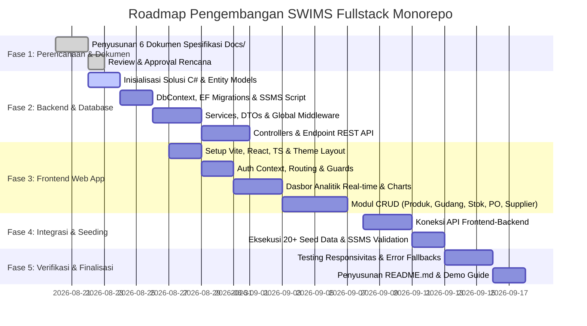

# PLANNING: Project Roadmap & Implementation Strategy

## 1. Roadmap Pelaksanaan Proyek (Project Phases)

Pengembangan **Smart Warehouse & Inventory Management System (SWIMS)** dibagi ke dalam 5 fase terstruktur:

---

## 2. Rincian Fase & *Deliverables*

### Fase 1: Perencanaan & Perancangan Arsitektur (Docs Phase)
- **Tujuan**: Menghasilkan spesifikasi teknis lengkap yang menjadi acuan baku pengembangan.
- **Output Berkas**:
  - `Docs/CONTEXT.md` (Latar belakang, masalah bisnis, RBAC matrix, matriks kepatuhan S1)
  - `Docs/SCHEMA.md` (Kamus data 3NF, ERD, relasi 1:1, 1:N, N:1, M:N, 3 tabel soft delete, 20+ seed data)
  - `Docs/API_SPECS.md` (Kontrak REST API lengkap, skema JSON, error handling, parameter filter/sort/pagination)
  - `Docs/ARCHITECTURE.md` (Arsitektur monorepo, pola C# Clean Layered, diagram alur/flowchart Mermaid)
  - `Docs/PLANNING.md` (Roadmap, timeline, strategi mitigasi risiko)
  - `Docs/PROGRESS.md` (Lembar pelacak progres interaktif)

---

### Fase 2: Backend C# ASP.NET Core & Database SQL Server (SSMS)
- **Tujuan**: Membangun fondasi server yang tangguh, aman, dan berkinerja tinggi.
- **Aktivitas Utama**:
  1. Inisialisasi folder `backend/` dengan proyek `SmartWarehouse.Api` (.NET 10 / .NET 9).
  2. Pembuatan 11 Domain Entities (`User`, `UserProfile`, `Role`, `Category`, `Warehouse`, `Product`, `Supplier`, `InventoryStock`, `StockTransaction`, `PurchaseOrder`, `PurchaseOrderItem`).
  3. Konfigurasi `AppDbContext` dengan Global Query Filters untuk *Soft Delete* dan otomatisasi `created_at` & `updated_at`.
  4. Penyusunan `DbSeeder` dan pembuatan berkas script SQL mandiri (`init_database.sql`) yang siap dieksekusi di SSMS.
  5. Pembuatan `GlobalExceptionMiddleware` untuk menangani status 400, 401, 403, 404, 422, dan 500 secara konsisten.
  6. Implementasi autentikasi JWT + Refresh Token dan enkripsi sandi BCrypt.
  7. Implementasi seluruh Controller REST API lengkap dengan validasi FluentValidation dan upload file.

---

### Fase 3: Frontend Modern Web App (React + TypeScript + Vite)
- **Tujuan**: Membangun antarmuka pengguna yang responsif, intuitif, cepat, dan estetis.
- **Aktivitas Utama**:
  1. Inisialisasi folder `frontend/` menggunakan Vite + React + TypeScript.
  2. Implementasi layout modern responsif (Mobile, Tablet, Desktop) dengan sidebar navigasi interaktif.
  3. Konfigurasi Client-Side Routing (Public Routes, Private Routes, dan Role-Based Guards) serta penanganan halaman error (401, 403, 404, 500).
  4. Implementasi dasbor analitik real-time dengan kartu ringkasan KPI dan visualisasi grafik Chart.js.
  5. Pembuatan antarmuka CRUD lengkap dengan fitur pencarian kata kunci, multi-filter, sorting, paginasi, dan notifikasi Toast.
  6. Komponen upload file dengan drag-and-drop dan pratinjau langsung untuk foto produk dan dokumen PDF.

---

### Fase 4: Integrasi Monorepo & Validasi Database
- **Tujuan**: Memastikan kelancaran komunikasi antara frontend dan backend serta ketersediaan data awal.
- **Aktivitas Utama**:
  1. Pengujian komunikasi API end-to-end melalui Axios interceptor.
  2. Menjalankan *Database Seeder* untuk mengisi minimal 20 data pada setiap tabel utama.
  3. Verifikasi data di SQL Server Management Studio (SSMS).

---

### Fase 5: Pengujian Menyeluruh & Penyerahan (*Final Delivery*)
- **Tujuan**: Memverifikasi seluruh kriteria penilaian S1 dan menyiapkan dokumen penyerahan.
- **Aktivitas Utama**:
  1. Pengujian otomatis: `dotnet build` dan `npm run build`.
  2. Pembuatan berkas `README.md` pada root direktori yang memuat panduan instalasi, struktur folder, kredensial akun demo, dan tata cara pengujian.
  3. Pembaruan final berkas `Docs/PROGRESS.md`.

---

## 3. Matriks Manajemen Risiko & Mitigasi (Risk Management)

| Potensi Risiko | Tingkat Risiko | Dampak | Strategi Mitigasi |
| :--- | :---: | :---: | :--- |
| **Ketidaksesuaian Driver SQL Server** | Sedang | Koneksi DB Gagal | Menyediakan script SQL mandiri (`init_database.sql`) selain EF Migrations sehingga database dapat di-*restore* langsung via SSMS. |
| **Kelebihan Ukuran Upload Berkas** | Rendah | Server Beban Tinggi | Menerapkan validasi ukuran maksimal (5MB Gambar, 10MB PDF) dan whitelist ekstensi file pada sisi frontend dan backend. |
| **Kebocoran Token Autentikasi** | Sedang | Akses Tak Berhak | Masa berlaku Access Token dibatasi singkat (60 menit), menggunakan HTTPS, dan validasi signature ketat di backend. |
| **Inkonsistensi Saldo Stok saat Mutasi** | Tinggi | Selisih Stok Fisik | Menggunakan Database Transaction (`IDbContextTransaction`) pada seluruh proses mutasi dan penerimaan PO dengan mekanisme rollback otomatis jika terjadi kegagalan. |
