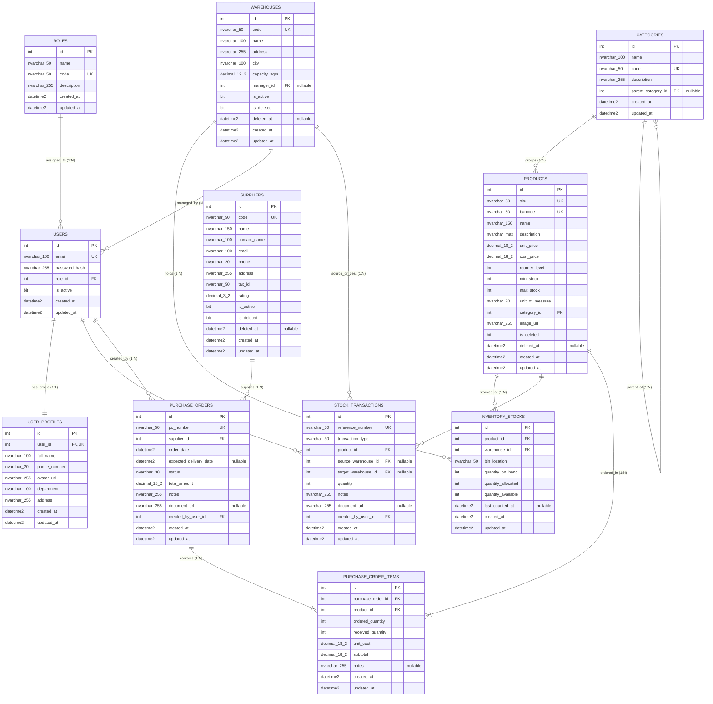

# SCHEMA: Database Architecture & Data Dictionary

## 1. Diagram Relasi Entitas (Entity Relationship Diagram - ERD)



---

## 2. Analisis Normalisasi (1NF, 2NF, 3NF)

Desain basis data SWIMS memenuhi aturan normalisasi hingga tingkat **Third Normal Form (3NF)**:

1. **First Normal Form (1NF)**:
   - Setiap kolom hanya memuat nilai atomik tunggal (*atomic value*), tidak ada array atau grup berulang dalam satu kolom (*no repeating groups*).
   - Setiap tabel memiliki *Primary Key* unik (`id`).
2. **Second Normal Form (2NF)**:
   - Telah memenuhi 1NF.
   - Tidak terdapat ketergantungan parsial (*no partial dependency*). Semua atribut non-kunci sepenuhnya bergantung secara fungsional pada keseluruhan *Primary Key*. Pada tabel penghubung Many-to-Many `PURCHASE_ORDER_ITEMS`, subtotal dan kuantitas bergantung penuh pada kombinasi item pesanan.
3. **Third Normal Form (3NF)**:
   - Telah memenuhi 2NF.
   - Tidak terdapat ketergantungan transitif (*no transitive dependency*). Atribut non-kunci tidak bergantung pada atribut non-kunci lainnya. Sebagai contoh, data detail profil pengguna dipisahkan ke tabel `USER_PROFILES`, kategori induk ke tabel relasional `CATEGORIES`, dan informasi kontak pemasok disimpan terpisah di `SUPPLIERS`.

---

## 3. Kamus Data Lengkap (Data Dictionary)

### 3.1. Tabel `Roles`
Menyimpan wewenang dan hak akses pengguna sistem.

| Nama Kolom | Tipe Data | Nullable | Default | Keterangan |
| :--- | :--- | :---: | :---: | :--- |
| `id` | `INT` | No | IDENTITY(1,1) | Primary Key |
| `name` | `NVARCHAR(50)` | No | - | Nama role (e.g., 'Super Admin') |
| `code` | `NVARCHAR(50)` | No | - | Kode unik role (e.g., 'ROLE_ADMIN') (UNIQUE) |
| `description` | `NVARCHAR(255)`| Yes | NULL | Deskripsi cakupan wewenang |
| `created_at` | `DATETIME2` | No | SYSUTCDATETIME() | Waktu pencatatan |
| `updated_at` | `DATETIME2` | No | SYSUTCDATETIME() | Waktu pembaruan |

### 3.2. Tabel `Users`
Menyimpan kredensial akun pengguna untuk proses autentikasi.

| Nama Kolom | Tipe Data | Nullable | Default | Keterangan |
| :--- | :--- | :---: | :---: | :--- |
| `id` | `INT` | No | IDENTITY(1,1) | Primary Key |
| `email` | `NVARCHAR(100)`| No | - | Alamat email unik login (UNIQUE) |
| `password_hash` | `NVARCHAR(255)`| No | - | Hash sandi (BCrypt) |
| `role_id` | `INT` | No | - | FK -> `Roles.id` |
| `is_active` | `BIT` | No | 1 | Status aktifasi akun (1=Aktif, 0=Nonaktif) |
| `created_at` | `DATETIME2` | No | SYSUTCDATETIME() | Waktu pencatatan |
| `updated_at` | `DATETIME2` | No | SYSUTCDATETIME() | Waktu pembaruan |

### 3.3. Tabel `UserProfiles` (Relasi 1:1 dengan `Users`)
Menyimpan informasi personal dan identitas pengguna.

| Nama Kolom | Tipe Data | Nullable | Default | Keterangan |
| :--- | :--- | :---: | :---: | :--- |
| `id` | `INT` | No | IDENTITY(1,1) | Primary Key |
| `user_id` | `INT` | No | - | FK -> `Users.id` (UNIQUE) |
| `full_name` | `NVARCHAR(100)`| No | - | Nama lengkap |
| `phone_number`| `NVARCHAR(20)` | Yes | NULL | Nomor kontak |
| `avatar_url` | `NVARCHAR(255)`| Yes | NULL | URL / Path berkas foto avatar |
| `department` | `NVARCHAR(100)`| Yes | NULL | Departemen kerja |
| `address` | `NVARCHAR(255)`| Yes | NULL | Alamat domisili |
| `created_at` | `DATETIME2` | No | SYSUTCDATETIME() | Waktu pencatatan |
| `updated_at` | `DATETIME2` | No | SYSUTCDATETIME() | Waktu pembaruan |

### 3.4. Tabel `Categories`
Klasifikasi hierarki barang/produk pergudangan.

| Nama Kolom | Tipe Data | Nullable | Default | Keterangan |
| :--- | :--- | :---: | :---: | :--- |
| `id` | `INT` | No | IDENTITY(1,1) | Primary Key |
| `name` | `NVARCHAR(100)`| No | - | Nama kategori barang |
| `code` | `NVARCHAR(50)` | No | - | Kode unik kategori (UNIQUE) |
| `description` | `NVARCHAR(255)`| Yes | NULL | Deskripsi kelompok barang |
| `parent_category_id`| `INT` | Yes | NULL | Self-referencing FK -> `Categories.id` |
| `created_at` | `DATETIME2` | No | SYSUTCDATETIME() | Waktu pencatatan |
| `updated_at` | `DATETIME2` | No | SYSUTCDATETIME() | Waktu pembaruan |

### 3.5. Tabel `Warehouses` (*Soft Delete Table 1*)
Informasi lokasi fasilitas gudang fisik.

| Nama Kolom | Tipe Data | Nullable | Default | Keterangan |
| :--- | :--- | :---: | :---: | :--- |
| `id` | `INT` | No | IDENTITY(1,1) | Primary Key |
| `code` | `NVARCHAR(50)` | No | - | Kode unik gudang (e.g., 'WH-JKT-01') |
| `name` | `NVARCHAR(100)`| No | - | Nama fasilitas gudang |
| `address` | `NVARCHAR(255)`| No | - | Alamat fisik gudang |
| `city` | `NVARCHAR(100)`| No | - | Kota lokasi |
| `capacity_sqm` | `DECIMAL(12,2)`| No | 0.00 | Luas kapasitas area (m²) |
| `manager_id` | `INT` | Yes | NULL | FK -> `Users.id` (Kepala Gudang) |
| `is_active` | `BIT` | No | 1 | Status operasional gudang |
| `is_deleted` | `BIT` | No | 0 | Flag Soft Delete (0=Aktif, 1=Terhapus) |
| `deleted_at` | `DATETIME2` | Yes | NULL | Waktu penghapusan soft delete |
| `created_at` | `DATETIME2` | No | SYSUTCDATETIME() | Waktu pencatatan |
| `updated_at` | `DATETIME2` | No | SYSUTCDATETIME() | Waktu pembaruan |

### 3.6. Tabel `Products` (*Soft Delete Table 2*)
Katalog master barang dan inventaris.

| Nama Kolom | Tipe Data | Nullable | Default | Keterangan |
| :--- | :--- | :---: | :---: | :--- |
| `id` | `INT` | No | IDENTITY(1,1) | Primary Key |
| `sku` | `NVARCHAR(50)` | No | - | Stock Keeping Unit unik (UNIQUE) |
| `barcode` | `NVARCHAR(50)` | No | - | Kode Barcode / EAN-13 (UNIQUE) |
| `name` | `NVARCHAR(150)`| No | - | Nama barang |
| `description` | `NVARCHAR(MAX)`| Yes | NULL | Deskripsi spesifikasi |
| `unit_price` | `DECIMAL(18,2)`| No | 0.00 | Harga jual satuan (IDR) |
| `cost_price` | `DECIMAL(18,2)`| No | 0.00 | Harga pokok modal per unit (IDR) |
| `reorder_level`| `INT` | No | 10 | Batas kuantitas pemesanan ulang |
| `min_stock` | `INT` | No | 5 | Ambang stok kritis |
| `max_stock` | `INT` | No | 1000 | Kapasitas penyimpanan maksimal |
| `unit_of_measure`| `NVARCHAR(20)`| No | 'PCS' | Satuan (PCS, BOX, KG, METER) |
| `category_id` | `INT` | No | - | FK -> `Categories.id` |
| `image_url` | `NVARCHAR(255)`| Yes | NULL | Path berkas foto produk |
| `is_deleted` | `BIT` | No | 0 | Flag Soft Delete |
| `deleted_at` | `DATETIME2` | Yes | NULL | Waktu penghapusan soft delete |
| `created_at` | `DATETIME2` | No | SYSUTCDATETIME() | Waktu pencatatan |
| `updated_at` | `DATETIME2` | No | SYSUTCDATETIME() | Waktu pembaruan |

### 3.7. Tabel `Suppliers` (*Soft Delete Table 3*)
Data vendor/pemasok resmi rantai pasok.

| Nama Kolom | Tipe Data | Nullable | Default | Keterangan |
| :--- | :--- | :---: | :---: | :--- |
| `id` | `INT` | No | IDENTITY(1,1) | Primary Key |
| `code` | `NVARCHAR(50)` | No | - | Kode vendor (e.g., 'SUP-001') |
| `name` | `NVARCHAR(150)`| No | - | Nama perusahaan pemasok |
| `contact_name` | `NVARCHAR(100)`| No | - | Nama Person In Charge (PIC) |
| `email` | `NVARCHAR(100)`| No | - | Email korespondensi |
| `phone` | `NVARCHAR(20)` | No | - | Nomor telepon kontak |
| `address` | `NVARCHAR(255)`| No | - | Alamat kantor pemasok |
| `tax_id` | `NVARCHAR(50)` | Yes | NULL | NPWP / Nomor Pokok Wajib Pajak |
| `rating` | `DECIMAL(3,2)` | No | 5.00 | Rating performa pemasok (1.00 - 5.00) |
| `is_active` | `BIT` | No | 1 | Status aktifitas vendor |
| `is_deleted` | `BIT` | No | 0 | Flag Soft Delete |
| `deleted_at` | `DATETIME2` | Yes | NULL | Waktu penghapusan soft delete |
| `created_at` | `DATETIME2` | No | SYSUTCDATETIME() | Waktu pencatatan |
| `updated_at` | `DATETIME2` | No | SYSUTCDATETIME() | Waktu pembaruan |

### 3.8. Tabel `InventoryStocks`
Pencatatan saldo fisik dan alokasi stok per barang dan lokasi rak gudang.

| Nama Kolom | Tipe Data | Nullable | Default | Keterangan |
| :--- | :--- | :---: | :---: | :--- |
| `id` | `INT` | No | IDENTITY(1,1) | Primary Key |
| `product_id` | `INT` | No | - | FK -> `Products.id` |
| `warehouse_id` | `INT` | No | - | FK -> `Warehouses.id` |
| `bin_location` | `NVARCHAR(50)` | No | 'DEFAULT' | Kode rak/lorong/bin (e.g., 'A1-R02-B04') |
| `quantity_on_hand`| `INT` | No | 0 | Total stok fisik tersimpan |
| `quantity_allocated`| `INT` | No | 0 | Stok yang teralokasi order keluar |
| `quantity_available`| `INT` | No | 0 | Stok bebas (`on_hand` - `allocated`) |
| `last_counted_at`| `DATETIME2` | Yes | NULL | Waktu pelaksanaan *stock opname* terakhir |
| `created_at` | `DATETIME2` | No | SYSUTCDATETIME() | Waktu pencatatan |
| `updated_at` | `DATETIME2` | No | SYSUTCDATETIME() | Waktu pembaruan |

### 3.9. Tabel `StockTransactions`
Buku besar (*audit log*) pergerakan barang pergudangan.

| Nama Kolom | Tipe Data | Nullable | Default | Keterangan |
| :--- | :--- | :---: | :---: | :--- |
| `id` | `INT` | No | IDENTITY(1,1) | Primary Key |
| `reference_number`| `NVARCHAR(50)`| No | - | Nomor referensi unik (e.g., 'TRX-INB-2026-001') |
| `transaction_type`| `NVARCHAR(30)`| No | - | Tipe (`INBOUND`, `OUTBOUND`, `TRANSFER`, `ADJUSTMENT`) |
| `product_id` | `INT` | No | - | FK -> `Products.id` |
| `source_warehouse_id`| `INT` | Yes | NULL | FK -> `Warehouses.id` (Gudang asal) |
| `target_warehouse_id`| `INT` | Yes | NULL | FK -> `Warehouses.id` (Gudang tujuan) |
| `quantity` | `INT` | No | - | Jumlah unit mutasi |
| `notes` | `NVARCHAR(255)`| Yes | NULL | Catatan operasional |
| `document_url` | `NVARCHAR(255)`| Yes | NULL | Bukti serah terima / foto surat jalan |
| `created_by_user_id`| `INT` | No | - | FK -> `Users.id` (Petugas eksekutor) |
| `created_at` | `DATETIME2` | No | SYSUTCDATETIME() | Waktu pencatatan transaksi |
| `updated_at` | `DATETIME2` | No | SYSUTCDATETIME() | Waktu pembaruan |

### 3.10. Tabel `PurchaseOrders`
Dokumen pengadaan barang ke pemasok.

| Nama Kolom | Tipe Data | Nullable | Default | Keterangan |
| :--- | :--- | :---: | :---: | :--- |
| `id` | `INT` | No | IDENTITY(1,1) | Primary Key |
| `po_number` | `NVARCHAR(50)` | No | - | Nomor PO Unik (e.g., 'PO-2026-08-001') |
| `supplier_id` | `INT` | No | - | FK -> `Suppliers.id` |
| `order_date` | `DATETIME2` | No | SYSUTCDATETIME() | Tanggal pemesanan |
| `expected_delivery_date`| `DATETIME2`| Yes | NULL | Estimasi tanggal kirim |
| `status` | `NVARCHAR(30)` | No | 'PENDING' | Status (`DRAFT`, `PENDING`, `APPROVED`, `RECEIVED`, `CANCELLED`) |
| `total_amount` | `DECIMAL(18,2)`| No | 0.00 | Total nominal order (IDR) |
| `notes` | `NVARCHAR(255)`| Yes | NULL | Keterangan tambahan PO |
| `document_url` | `NVARCHAR(255)`| Yes | NULL | Berkas PDF Invoice / PO Resmi |
| `created_by_user_id`| `INT` | No | - | FK -> `Users.id` (Pembuat PO) |
| `created_at` | `DATETIME2` | No | SYSUTCDATETIME() | Waktu pencatatan |
| `updated_at` | `DATETIME2` | No | SYSUTCDATETIME() | Waktu pembaruan |

### 3.11. Tabel `PurchaseOrderItems` (Relasi M:N Antara `PurchaseOrders` dan `Products`)
Daftar rincian item barang pada setiap Purchase Order.

| Nama Kolom | Tipe Data | Nullable | Default | Keterangan |
| :--- | :--- | :---: | :---: | :--- |
| `id` | `INT` | No | IDENTITY(1,1) | Primary Key |
| `purchase_order_id`| `INT` | No | - | FK -> `PurchaseOrders.id` |
| `product_id` | `INT` | No | - | FK -> `Products.id` |
| `ordered_quantity` | `INT` | No | - | Jumlah unit dipesan |
| `received_quantity`| `INT` | No | 0 | Jumlah unit yang telah diterima |
| `unit_cost` | `DECIMAL(18,2)`| No | - | Harga beli per unit (IDR) |
| `subtotal` | `DECIMAL(18,2)`| No | - | Total nilai baris (`ordered_quantity` * `unit_cost`) |
| `notes` | `NVARCHAR(255)`| Yes | NULL | Catatan khusus item |
| `created_at` | `DATETIME2` | No | SYSUTCDATETIME() | Waktu pencatatan |
| `updated_at` | `DATETIME2` | No | SYSUTCDATETIME() | Waktu pembaruan |

---

## 4. Mekanisme Soft Delete & Query Filter

Tiga tabel mengimplementasikan *Soft Delete* (`Products`, `Suppliers`, dan `Warehouses`):
- Saat data dihapus via API `DELETE`, record tidak dihilangkan secara fisik melainkan nilai kolom `is_deleted` diubah menjadi `1` dan kolom `deleted_at` diisi waktu saat ini (`SYSUTCDATETIME()`).
- Pada Entity Framework Core, konfigurasi filter global diaktifkan:
  ```csharp
  modelBuilder.Entity<Product>().HasQueryFilter(p => !p.IsDeleted);
  modelBuilder.Entity<Supplier>().HasQueryFilter(s => !s.IsDeleted);
  modelBuilder.Entity<Warehouse>().HasQueryFilter(w => !w.IsDeleted);
  ```
- Ini menjamin relasi riwayat transaksi lama pada `StockTransactions` dan `PurchaseOrderItems` tetap terjaga integritasnya (*referential integrity*).

---

## 5. Rencana Data Awal (Seed Data Plan: Minimal 20 Baris per Tabel Utama)

Sistem menyertakan 20+ baris data *seed* komprehensif untuk pengujian aplikasi di SSMS:
1. **Roles**: 4 peran (`Super Admin`, `Warehouse Manager`, `Inventory Staff`, `Purchasing Officer`).
2. **Users**: 20 pengguna realistis (Admin, Manajer, Staff, Purchasing) dengan profil lengkap (`UserProfiles`).
3. **Categories**: 20 kategori produk terstruktur (Elektronik, Perkakas Mesin, Material Bangunan, Komputer & IT, Bahan Kimia Industri, Kemasan & Logistik, dsb.).
4. **Warehouses**: 20 lokasi fasilitas pergudangan di berbagai kota besar di Indonesia (Jakarta Utara, Cikarang, Karawang, Surabaya, Medan, Makassar, Semarang, Bandung, dsb.).
5. **Products**: 25+ produk pergudangan dengan SKU, barcode, deskripsi, batas stok, kategori, dan foto.
6. **Suppliers**: 20 vendor pemasok resmi berbadan hukum (PT/CV) dengan PIC, email, nomor telepon, dan rating.
7. **InventoryStocks**: 50+ pemetaan stok barang di berbagai lokasi rak gudang.
8. **StockTransactions**: 30+ riwayat transaksi barang masuk, keluar, transfer gudang, dan penyesuaian.
9. **PurchaseOrders**: 20+ dokumen PO pengadaan barang dengan variasi status.
10. **PurchaseOrderItems**: 50+ item rincian pemesanan barang.
