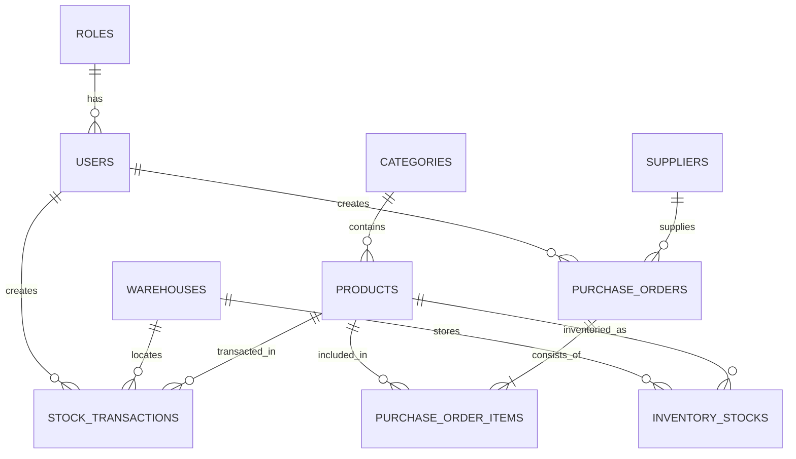

# 🏢 InvWare — Smart Warehouse & Inventory Management System (SWIMS)

[](https://dotnet.microsoft.com/)
[](https://reactjs.org/)
[](https://www.typescriptlang.org/)
[](https://vitejs.dev/)
[](https://www.microsoft.com/sql-server/)
[]()
[]()

> **Projekan S1 Portofolio**: Sistem Informasi Manajemen Pergudangan & Rantai Pasok Terintegrasi Skala Enterprise Berbasis Fullstack Monorepo (**C# ASP.NET Core Web API + Microsoft SQL Server + React TypeScript Vite**).

---

## 📖 1. Tentang Aplikasi (Overview)

**InvWare (Smart Warehouse & Inventory Management System)** adalah platform tata kelola rantai pasok dan pergudangan modern yang mendigitalisasi operasional logistik secara *end-to-end*. Sistem mengintegrasikan proses pengadaan barang (*Purchase Order*), penerimaan barang masuk (*Inbound*), pengeluaran barang (*Outbound*), mutasi transfer antar fasilitas gudang (*Warehouse Transfer*), dan penyesuaian stok (*Stock Opname Adjustment*).

Dibangun dengan arsitektur **Clean Separation of Concerns**, sistem ini mengisolasi seluruh logika bisnis, kalkulasi stok, dan audit keamanan di sisi backend, sementara frontend menyajikan antarmuka visual **Bento Flat Design System** yang responsif, berkecepatan tinggi, dan berestetika premium.

---

## ✨ 2. Fitur Unggulan Sistem

### 🔐 2.1. Keamanan & Autentikasi Modern
- **Role-Based Access Control (RBAC)** 4 Level:
  - `ROLE_ADMIN` (*Super Administrator*): Akses absolut ke semua modul, pengguna, dan konfigurasi.
  - `ROLE_MANAGER` (*Warehouse Manager*): Persetujuan PO, mutasi antar fasilitas, penyesuaian stok, dan audit log.
  - `ROLE_STAFF` (*Inventory Staff*): Input transaksi mutasi dan monitoring ketersediaan rak.
  - `ROLE_PURCHASING` (*Purchasing Officer*): Pembuatan PO dan tata kelola direktori pemasok.
- **Sistem Pemulihan Akun dengan 6-Digit OTP**:
  - Generator kode OTP acak kriptografis di server dengan masa berlaku **5 menit**.
  - Kotak input PIN 6 digit dengan navigasi otomatis (*auto-advance*), *backspace navigation*, dan *paste event handler*.
  - Countdown timer kirim ulang 60 detik dan mode demo portfolio 1-klik.
- **Proteksi Kata Sandi**: Enkripsi menggunakan **BCrypt Hashing** (salt factor 11) dan otorisasi sesi **JWT Bearer Token**.

### 📊 2.2. Dasbor Analitik & Real-Time Monitoring
- **4 Kartu KPI Interaktif**: Total Nilai Aset Stok, Peringatan Stok Menipis (*Low Stock Alert*), Total Transaksi Mutasi, dan Utilisasi Kapasitas Gudang (m²).
- **Multi-Currency Switcher**: Konversi instan tampilan nilai mata uang antara **Rupiah (IDR)** dan **US Dollar (USD)** secara dinamis.
- **Grafik Tren Mutasi Visual**: Analisis perbandingan volume *Barang Masuk (Inbound)* vs *Barang Keluar (Outbound)* dengan filter periode **3 Bulan, 6 Bulan, dan 12 Bulan**.
- **Tabel Fast-Moving Items & Feed Aktivitas Terkini**: Menampilkan 5 produk dengan perputaran tercepat dan log audit aktivitas staf secara langsung.

### 📦 2.3. Manajemen Inventaris & Master Data SKU
- **Katalog Produk Terpadu**: Manajemen SKU, Barcode, Kategori, Unit Satuan, Harga Jual, Harga Modal, Batas Min/Max Stok, dan Unggah Foto Produk (PNG/JPG/WEBP).
- **Pelacakan Fisik (*Stok & Lokasi Rak*)**:
  - Kalkulasi *On Hand Quantity*, *Allocated Quantity*, dan *Available Quantity* secara otomatis.
  - Manajemen Lokasi Bin/Rak (contoh: `A01-R01-B01`).
  - Indikator Status Kondisi Stok (*Aman, Menipis, Habis*).
- **Mutasi & Audit Transaksi**:
  - 4 Tipe Mutasi: `INBOUND`, `OUTBOUND`, `TRANSFER`, dan `ADJUSTMENT`.
  - Jejak audit lengkap mencakup nomor referensi dokumen, berkas lampiran, nama staf pelaksana, dan stempel waktu.
- **Alur Siklus Hidup Pengadaan (Purchase Order)**:
  - Alur status: `DRAFT` ➔ `PENDING` ➔ `APPROVED` ➔ `RECEIVED` / `CANCELLED`.
  - Unggah faktur / dokumen PO (PDF).
  - **Otomatisasi Stok Masuk**: Penerimaan barang pada PO yang disetujui otomatis menambah saldo fisik di gudang target dan mencatat transaksi Inbound.

### 📑 2.4. Ekspor Data Native Excel (.xlsx)
- Ekspor seluruh basis data ke berkas native Excel (`.xlsx`) via **SheetJS** dengan format kolom teratur dan auto-fit lebar kolom pada setiap tabel:
  - *Katalog Produk*, *Stok & Lokasi Rak*, *Riwayat Mutasi Transaksi*, *Purchase Orders*, *Jaringan Fasilitas Gudang*, dan *Direktori Pemasok*.

---

## 🛠️ 3. Arsitektur & Teknologi

```
                         [ CLIENT BROWSER ]
                                 │
                 (React 19 + TypeScript + Vite 8)
                 (Bento Flat CSS + Axios Client)
                                 │ HTTP / JSON (REST)
                                 ▼
                     [ ASP.NET CORE 10 WEB API ]
           ┌─────────────────────┼─────────────────────┐
           ▼                     ▼                     ▼
   [ FluentValidation ]   [ JWT / BCrypt Auth ]   [ Global Error ]
           └─────────────────────┬─────────────────────┘
                                 │ Entity Framework Core 10
                                 ▼
                 [ MICROSOFT SQL SERVER (3NF) ]
```

| Komponen | Spesifikasi / Library |
| :--- | :--- |
| **Backend** | C# ASP.NET Core 10 Web API |
| **ORM & Database Provider** | Entity Framework Core 10 (SQL Server) |
| **Basis Data** | Microsoft SQL Server 2022 / SQLEXPRESS / LocalDB (Skema 3NF) |
| **Validasi & Keamanan** | FluentValidation, BCrypt.Net-Next, JWT Bearer Token |
| **Dokumentasi API** | Swagger UI / OpenAPI Spec (`/swagger`) |
| **Frontend** | React 19, TypeScript 5.x, Vite 8 |
| **Desain Antarmuka** | Custom Bento Flat Design System (`#2C2424` & `#FAF7EE`) |
| **Grafik & Visualisasi** | Chart.js & React-Chartjs-2 |
| **Pengolah Excel** | SheetJS (`xlsx`) |
| **Ikonografi** | Lucide React Icons |

---

## 🗄️ 4. Skema Database Relasional 3NF

Basis data terdiri dari 11 entitas relasional terstandardisasi **Third Normal Form (3NF)** lengkap dengan stempel audit `created_at`, `updated_at`, dan *Soft Delete* otomatis (`is_deleted`):



---

## 🔑 5. Akun Pengujian Demo (Preset Credentials)

| Role Akses | Email Pengguna | Kata Sandi | Deskripsi Wewenang |
| :--- | :--- | :---: | :--- |
| **Super Admin** | `admin@smartwarehouse.com` | `Password123!` | Hak akses penuh ke seluruh modul & manajemen user. |
| **Warehouse Manager** | `manager.jkt@smartwarehouse.com` | `Password123!` | Persetujuan PO, penyesuaian opname, dan mutasi stok. |
| **Inventory Staff** | `staff.jkt1@smartwarehouse.com` | `Password123!` | Input mutasi fisik gudang dan pemantauan rak. |
| **Purchasing Officer** | `purchasing.lead@smartwarehouse.com` | `Password123!` | Pembuatan PO pengadaan dan direktori vendor. |

---

## 🚀 6. Panduan Menjalankan Aplikasi (Quick Start)

### Prasyarat Sistem:
- **.NET SDK 10 / 9** (`dotnet --version`)
- **Node.js v20+** & **npm** (`node -v`)
- **Microsoft SQL Server** (SQLEXPRESS / LocalDB / SSMS)

---

### Langkah 1: Jalankan Backend ASP.NET Core API

1. Masuk ke direktori backend:
   ```bash
   cd backend/SmartWarehouse.Api
   ```
2. Jalankan aplikasi:
   ```bash
   dotnet run
   ```
3. Backend akan aktif pada:
   - **REST API**: `http://localhost:5000/api`
   - **Swagger OpenAPI Docs**: `http://localhost:5000/swagger`
   *(Database `SmartWarehouseDb` dan 20+ seed data otomatis di-migrasi pada start pertama).*

---

### Langkah 2: Jalankan Frontend React TypeScript

1. Buka terminal baru dan masuk ke direktori frontend:
   ```bash
   cd frontend
   ```
2. Pasang dependensi:
   ```bash
   npm install
   ```
3. Jalankan server pengembang:
   ```bash
   npm run dev
   ```
4. Buka browser pada:
   **`http://localhost:5173`**

---

## 📂 7. Struktur Direktori Proyek

```
Smart Warehouse & Inventory Management System/
├── Docs/                                    # Spesifikasi Teknis S1 & Panduan Arsitektur
│   ├── API_SPECS.md                         # Kontrak Endpoint REST API & DTO
│   ├── ARCHITECTURE.md                      # Diagram Alur & Flowchart Sistem
│   ├── CONTEXT.md                           # Problem Statement & Matriks RBAC
│   ├── PLANNING.md                          # Roadmap & Tahapan Pengembangan
│   ├── PROGRESS.md                          # Checklist Kelengkapan Modul
│   └── SCHEMA.md                            # Kamus Data 3NF & Definisi Relasi ERD
│
├── backend/                                 # C# ASP.NET Core 10 Web API
│   ├── SmartWarehouse.sln
│   └── SmartWarehouse.Api/
│       ├── Controllers/                     # Auth, Products, Inventory, PO, Warehouses, Users
│       ├── Data/                            # DbContext & Database Seeder (20+ Seed Baris)
│       ├── DTOs/                            # Request & Response Contracts
│       ├── Middleware/                      # Global Error Handler & Response Envelope
│       ├── Models/Entities/                 # 11 Domain Relational Entities
│       ├── Services/                        # JwtService & FileUploadService
│       ├── Validators/                      # FluentValidation Rules
│       └── Program.cs                       # Server & Dependency Injection Setup
│
├── frontend/                                # React 19 + TypeScript + Vite SPA
│   ├── src/
│   │   ├── components/                      # DataTable, Modal, StatusBadge, FileUpload
│   │   ├── context/                         # AuthContext (JWT & OTP) & ToastContext
│   │   ├── layouts/                         # MainLayout (Sidebar) & AuthLayout
│   │   ├── pages/                           # Dashboard, Products, Inventory, PO, Profile, dll.
│   │   ├── routes/                          # AppRoutes & Role-Based Route Guards
│   │   ├── services/                        # Axios API Client Modules
│   │   └── types/                           # TypeScript Domain Models & Enums
│   ├── package.json
│   └── vite.config.ts
│
├── .gitignore                               # Aturan Eksklusi Git Monorepo
└── README.md                                # Dokumentasi Utama Repositori
```

---

## 📄 8. Lisensi & Hak Cipta

Proyek ini dikembangkan oleh **Fajar Sidik** sebagai portofolio implementasi sistem informasi pergudangan modern skala enterprise.

&copy; 2026 **Fajar Sidik** — All Rights Reserved.
